文章翻译, 阅读, 解读MTF曲线, 笔记总结
# Preface

The following context and material are sourced from Dr. H.H. Nasse's articles.  Many many thx for sharing and explain MTF in the preview articles.  However, I still had no understanding at all when I read those articles during my first year of bachelor studies. I will attempt to write this article in my own words without using any grammar or AI tools.  I have to say in some places, I will use some “direct copy” sentences. I don't consider this as a form of academic plagiarism, as I am writing this post for learning in photography as an enthusiast.

I listed the all used article below. Again, I will use some images and words directly without any citations. If you have any concerns about this post, PLZ contact me at (notmyemailcode@gmail.com) for specific sections throughout the entire article. I will do it for you ASAP. 


[1]**Intro. (ZEISS page)** 

[https://lenspire.zeiss.com/photo/en/article/measuring-lenses-objectively-why-do-we-need-mtf-curves-by-dr-hubert-nasse-part-1](https://lenspire.zeiss.com/photo/en/article/measuring-lenses-objectively-why-do-we-need-mtf-curves-by-dr-hubert-nasse-part-1)

[2]**How to Read MTF Curves**(December 2008)

[http://lenspire.zeiss.com/photo/app/uploads/2018/04/Article-MTF-2008-EN.pdf](http://lenspire.zeiss.com/photo/app/uploads/2018/04/Article-MTF-2008-EN.pdf)

[3]**How to read MTF curves? Part II**(March 2009)

 [https://lenspire.zeiss.com/photo/app/uploads/2018/04/CLN_MTF_Kurven_2_en.pdf](https://lenspire.zeiss.com/photo/app/uploads/2018/04/CLN_MTF_Kurven_2_en.pdf)

[4] 如何閱讀MTF(一), Weifu Lin 林渭富 [如何閱讀mtf-f85a60cf59c](https://medium.com/one-eyed-poet/)

(以上引用都没有被作者授权, 如有侵权, 本人会尽快删除, 文章承认前置的引用的文章的所有贡献.  本文章没有传播价值和商业价值, 是我看了引用的文章的笔记, 理解上的总结与整理 )

The main purpose for this article is helping me in realizing how designers made an excellent lens in the past and to understand which are favorable features for a good lens. And Iet me select suitable apertures not only by weather and sun

I  wanna finish this work in 2 days (2024.06.17-2024.06.18).  太难了, 最后看了一个礼拜才看了一半不到. 

The final date for this article is 7.6

淦, 还是用中文写吧. 

# START here

photographers want to take a very natural-looking picture of a subject, the lens should be sharp, which means that the lens will reflect the correct image of the view. As you know, the light line can gather in a light point on the frame plane. The perfect lens needs to show this “point” in the image correctly, but the truth is that the lens cannot do that on every surface. In the article, the Dr. H.H. Nasse give the example pic below, I attached this image below.

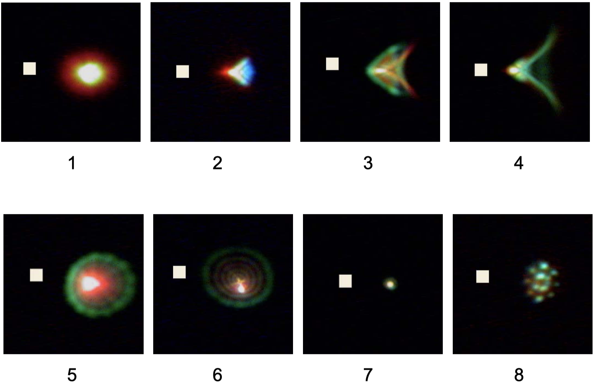

原始圖片來源 & Credit：Hubert H. Nasse, *How to Read MTF Curves, page 6,* [《LENSPIRE》](https://lenspire.zeiss.com/photo/en/article/overview-of-zeiss-camera-lenses-technical-articles/) 

this pic indicates 8 satuations in a size comparison, which all input a small white square light, but totally output different light results in cmos(tip: pic7 should be the perfect example) 


## 调制传递（Modulation Transfer）

### Sinusoidal brightness distribution

下面是文章中第一次出现的需要解释的图

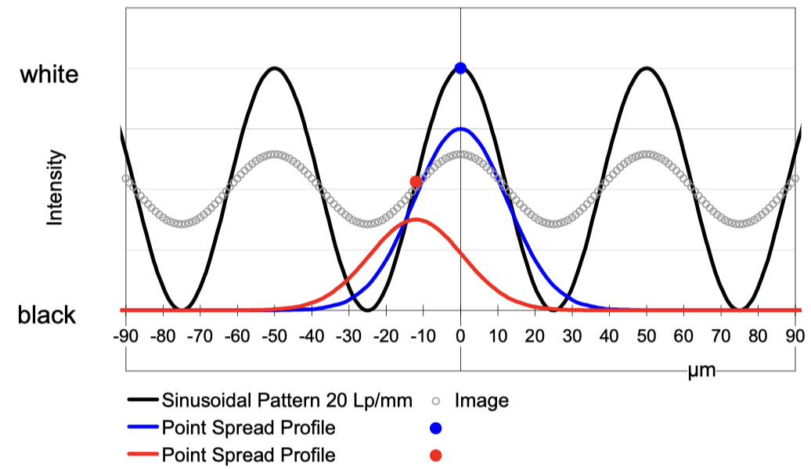

原始圖片來源 & Credit：Hubert H. Nasse, *How to Read MTF Curves, page 6,* [《LENSPIRE》](https://lenspire.zeiss.com/photo/en/article/overview-of-zeiss-camera-lenses-technical-articles/) 。

在原文中, 作者提到 Since we are primarily interested in how extended objects are imaged, objects which, unlike stars, comprise an infinite number of points, we must find another way to quantitatively describe the image quality. 于是我们使用sinusoidal brightness distribution来量化. 正弦波是一个连续的、周期性的波形，它在数学上非常容易描述和分析. 

如果把原始的光源场景想象成一个简单的正弦函数的话(sinusoidal brightness distribution是明亮和黑暗条纹的图案), 那么在比如说光线在经过镜头以后, 如果成像系统是完美的，我们应该得到一个清晰的、与原始正弦波相同的图像。也可以说, 使用正弦图像我可以得到一个稳定的结果进行分析. 这里的稳定不是指成像质量.

但是成像系统总是存在一些缺陷，玻璃的折射, 空气灰尘, 传感器的噪声. 实际得到的图像正弦波会与原始的场景的正弦波有所不同。 但是Several of its properties also remain stable or at least have nothing to do with imaging quality: The direction of the stripes does not change and the frequency – the number of stripes per unit length – only changes according to the imaging scale.

由于成像系统的缺陷, 光线不会完美地聚焦在它应该聚焦的地方。这就导致了所谓的“点扩散”. 也就是说, 某光线不仅照亮了应该照亮的区域, 也让周围应该是暗的区域发亮了.  这种光线的扩散效应改变了明暗条纹之间的亮度差异，使得图像的对比度降低。

回到需要解释的图, 


黑色曲线代表了实际风景的正弦条纹的亮度分布(which means 原始的一个简单明暗分布), 而空心圆组成的image线条是实际成像后的结果图, 可以认为是照片的实际效果, 这里埋一个伏笔. 

然后是红色点和红色线, 蓝色点和蓝色线, 这是一开始我没有理解的部分, 我以为有什么特殊含义, 但是, 其实这组Point Spread Profile说明了有一个点光源分别在成像的时候, 落在了某个地方对原始光线造成了影响, 点作为亮度最高的部分, 下面的曲线则代表了光源的Profile, 很好理解. 从最亮的地方, 逐渐减弱,这样. 

于是定义来了, 

1⃣️ the difference between bright and dark is referred to as “contrast”. 

2⃣️ the difference between maximum and minimum for all sinusoidal, periodically changing quantities is called “modulation.”

那么这两个相似表述的区别是什么, GPT说, **对比度**通常通过比较图像中最亮和最暗部分的亮度来衡量。**调制**通过信号的最大值和最小值的差异来衡量，反映信号的幅度变化。OK还是没理解, 回到图.

如果我们使用对比度的相关概念来描述, 在一张高对比度的照片中，太阳的亮光和树影的黑暗之间的差异非常明显。而使用调制的逻辑是, 在一个**调制较高**的正弦波信号中，波峰的高度和波谷的深度之间的差异非常大。

我感觉这里光学的modulation和信号处理的modulation的差距有点大, 虽然学的不精, 但是依稀记得是改变载波信号的幅度/频率/相位来传递信息(AM,FM,PM), 好的按下不表. 

在这里之前的伏笔来了, "对比度"指图像中明暗区域之间的差异, 但是在事实上, 是我们判断镜头分辨率的关键.

我们引出了

## 调制传递函数（MTF）

用来评估光学系统将物体上的调制传递到图像中的能力。通过比较图像的调制(图像)与物体的调制(图像)来计算，结果是一个介于0和1（或0%到100%）之间的数值。

在这里文章给出了一个列子,有点难理解的, The photographer is used to expressing bright-dark differences in aperture stops, which is also very reasonable as the perception of our eyes follows such logarithmic scales. But, what, for example, does a modulation transfer of 50% mean if our pattern of stripes consists of a difference of 6 aperture stops between the brightest and darkest points, i.e. a brightness ratio of $1 : 2^6  = 1 : 64 $ ? Is the difference in the image 3 aperture stops or $1:32$, which would correspond to 5 aperture stops? 神来一笔, 我们如何理解 **modulation transfer of 50%**, 调制传递率（Modulation Transfer）的50%并不是指整体画面会变暗50%。 Both would be wrong. In reality, we would then still have approximately 1.5 aperture stops in the above-mentioned case.

给出Contrast计算的公式
$$
\text{Contrast} = \frac{\text{Maximum} - \text{Minimum}}{\text{Maximum} + \text{Minimum}}
$$
我觉得还是挺容易理解的公式, 带入Contrast值=50%, 然后文章给出了例子, 没看懂从哪里来的, Therefore, in our example, the contrast of the object is 63 divided by 65, or approx. 哦, 就是突然给了两个值, Maximun-Minmun=63, Maximun+Minmun=65, 再63÷65≈0.97. 作为经过调制传递率为50%的成像，我的理解是满足上面那个公式上的定义, 然后MTF=50% 开始定义, 这时候文章下面有一个图我去比较了, 结果又理解错了. 正常的步骤是直接得出0.97的一半, 大约是0.48, 然后 (x-1)/(x+1)=0.48得到我们的估算值为 x≈2.846, 所以我们的档位从6掉到了2.846, 光量从64掉到了7.19004101289. 我在这里还是没有理解档位的问题…见下图

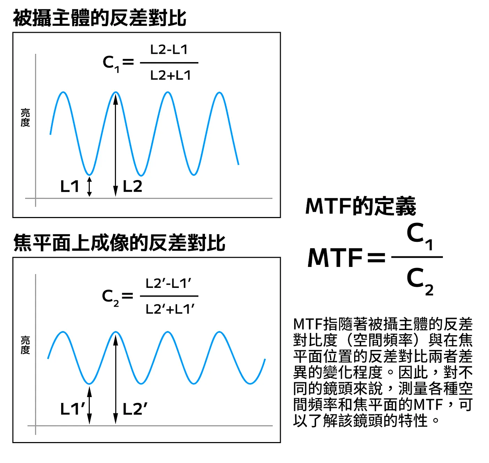

圖３：將反差對比的定義以正弦波圖形表示，兩者比値與測量位置情報共同構成MTF曲線。本圖經過翻譯及重繪。原始圖片來源 & Credit：戶村賢一、〈MTF：MTF曲線から読み取るレンズ特性の正体〉、page 128、《ライカ通信》 Vol.1, 2000年4月。


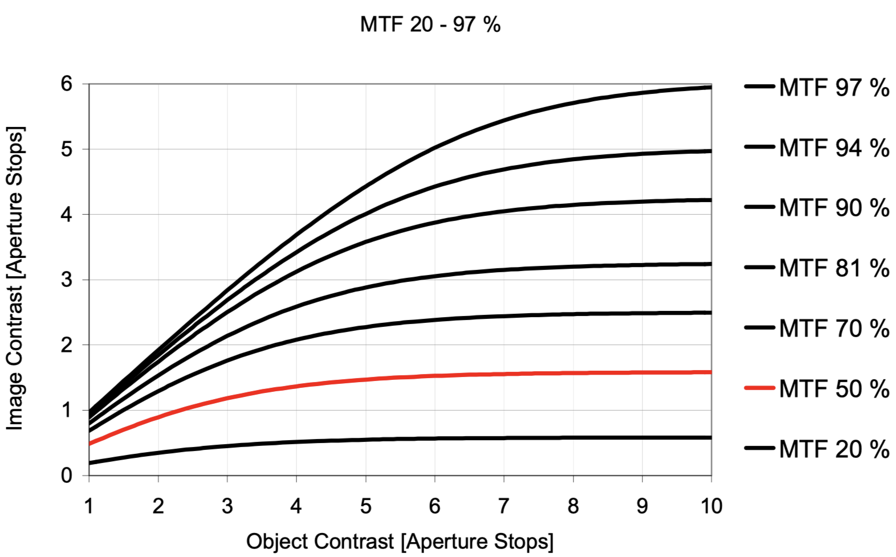

原始圖片來源 & Credit：Hubert H. Nasse, *How to Read MTF Curves, page 6,* [《LENSPIRE》](https://lenspire.zeiss.com/photo/en/article/overview-of-zeiss-camera-lenses-technical-articles/) 。

为什么这么像PN结放大…

我感觉这个地方, 一开始也有理解错的地方, 我的疑惑点有这些

1. MTF在图像中, 在曲线上是一个固定的参数, 好像是不会变化的, 但是在调整光圈档位的时候, 传感器接收到的maximum和minimum的光会减少, 我感觉这个在光圈变化后会变化, 但是MTF没有变.
2. 如果研究的目标是Object, 那我感觉光圈变化不会影响MTF啊, 因为环境的maximum和minimum的光量不会变啊
3. 对档位的理解有点奇怪, 0,1,2,3,4,5档, 如果使用$2^n$ 来理解的话, 可能可以想通, 我之前一直没搞明白, 就是越调档, 光量越小, 结果更加好? 反正我觉得有点奇怪. 
4. 这里档位, 有个点没有明白就是比如, object contract有10档, image contact只有最高有6档, 那么object contract的10档中的第6档和image contact的最高档第6档的光照亮度强度是一样的么
5. 横坐标从1开始的, 有点没理解

OK我觉得这里的混淆, 主要是由于参照坐标系的混乱造成的.

那么这个图怎么看呢, 比如取最高点(MTF=97%进入平缓发展的点), 取(10,6)点为例, Object Contrast (Aperture Stops) = 10, Image Contrast (Aperture Stops) = 6, 使用contact的定义, 在 $2^n$带入6和10, 得到64和1024(最高亮度值), 他们的最低值都是1, 所以
$$
\text{Object Contrast} = \frac{L_{\text{max, object}} - L_{\text{min, object}}}{L_{\text{max, object}} + L_{\text{min, object}}} = \frac{1024 - 1}{1024 + 1} = \frac{1023}{1025} \approx 0.9976
$$
再得
$$
\text{Image Contrast} = \frac{L_{\text{max, image}} - L_{\text{min, image}}}{L_{\text{max, image}} + L_{\text{min, image}}} = \frac{64 - 1}{64 + 1} = \frac{63}{65} \approx 0.9692
$$
这里引出/使用计算mtf的公式
$$
\text{MTF} = \frac{\text{Image Contrast}}{\text{Object Contrast}} = \frac{0.9692}{0.9976} \approx 0.97153167602
$$
下面是作者对于这个图的简单总结, 一开始没懂怎么来的, 感觉还挺难理解的.

我们可以从三个方面来理解 MTF 曲线的特性：

1. **高 MTF 值的小差异在高物体对比度下特别显著**：
    - 当物体对比度很高时（例如光圈档位为 9 或 10），MTF 曲线的高值（例如 90% 或 97%）之间的细微差异对图像质量有很大影响。即使 MTF 仅从 90% 增加到 97%，在高对比度的物体下，这种小的差异也能显著提高图像的对比度。
    - 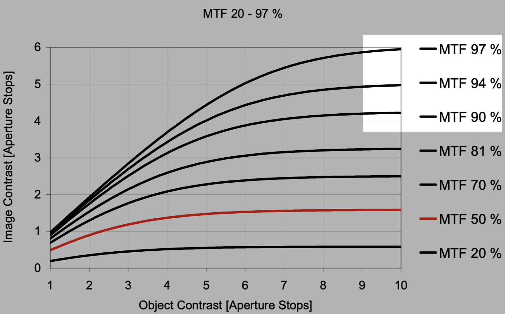
    
2. **弱的色调变化（小于一个光圈档位）不需要高 MTF 值**：
    - 当物体对比度较低（例如低于一个光圈档位时），高于 70-80% 的 MTF 值差异几乎没有实际意义。这意味着在低对比度场景中，即使 MTF 下降到 70-80%，也不会对图像质量造成明显影响。
    - 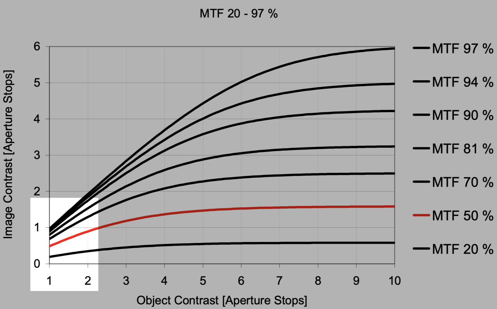
    
3. **非常低的 MTF 值下，物体对比度的高低几乎没有影响**：
    - 当 MTF 值非常低（例如低于 20%），无论物体的对比度多高，图像的对比度总是很低。这表明系统在低 MTF 下对比度还原能力很差，导致图像质量大幅下降。
    - 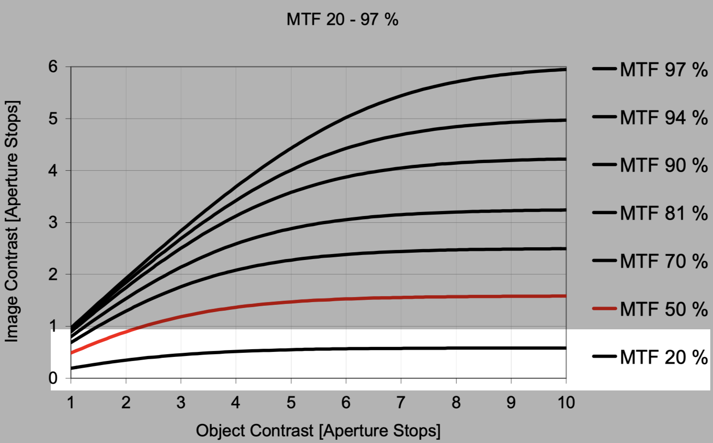

OK, 在看了这三个特征总结之后,  object光圈档位调整的含义和具体的光圈档位感觉可以澄清, 就是不同的光量, 如果两个contract都是处在Aperture stop=6的情况下的话, 他们的光量都是$2^6=64$, 也就是说是一样的. 我一直有一个错误的想法, 就是把一个环境和一个传感器上的光均匀切割, 然后分成不同的等份作为不同档位的错误理解.   调制传递函数（MTF）表示成像系统在不同空间频率下传递对比度的能力, 

```java
这个位置的小节, 我觉得我从这段文本得到的新的认知是, 我在之前从来不知道,对比度, 明暗,对清晰度的影响, 或者说对比度在直接控制清晰度? 感觉这个说法有问题, OK, 在对岸的一个作者的一篇文章上找到了答案.
```

下面小结的内容来自Weifu Lin在Medium平台上的文章, 链接在 [如何閱讀MTF(一)](https://medium.com/one-eyed-poet/%E5%A6%82%E4%BD%95%E9%96%B1%E8%AE%80mtf-f85a60cf59c) , 是作者结合蔡司的这篇文章和日本的一个作者的文章的翻译. 有两个图非常非常好, 指明了contract和Resolution的区别.

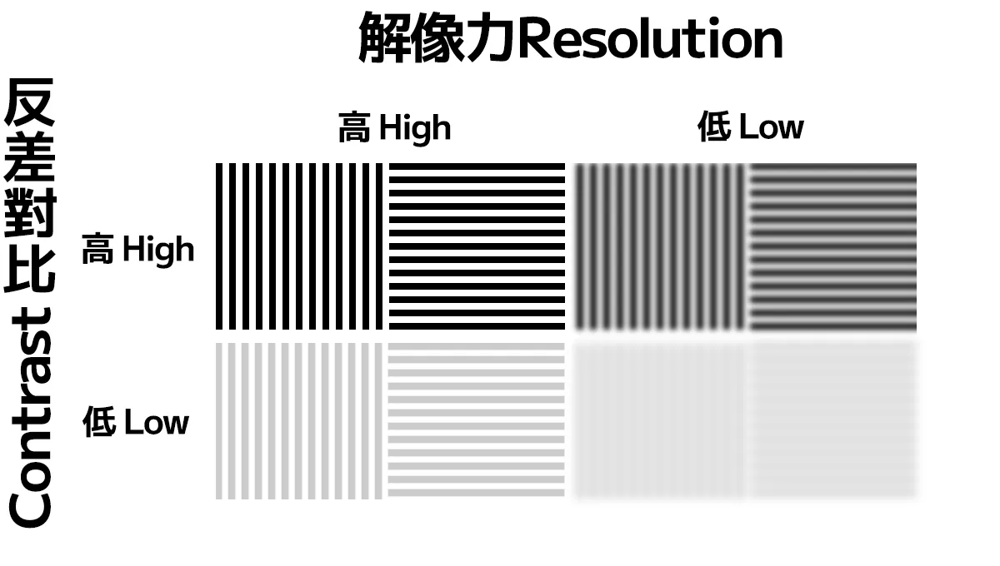

繪圖：Weifu Lin

**这里的内容是直接引用的[5].** 兩種不同設計取向的鏡頭的比較。鏡頭B的解像力較高，但實際拍攝時，鏡頭A會給觀賞者「更銳利」的觀感。箭號位置所指的虛線，是人眼能分辨細節的最低臨界點。本圖經過翻譯、修訂以及重繪。原始圖片來源 & Credit：戶村賢一、〈MTF：MTF曲線から読み取るレンズ特性の正体〉、page 129、《ライカ通信》 Vol.1, 2000年4月。

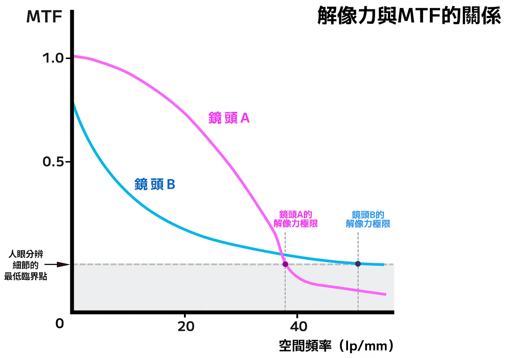

到这一步的时候, 我有点没看懂…

## Modulation transfer function, resolving power

*It is obvious that one single stripe pattern is not sufficient to characterize the quality of a lens. A very coarse pattern with large separations between bright and dark stripes could, of course, also be imaged well by a lens with a relatively large point spread function. If we decrease the separation between the stripes, however, so that the separation between bright and dark approaches the size of the point spread, then a lot of light from the bright zone is radiated into the darker zones of the pattern and the image contrast becomes noticeably lower.* 我觉得可以理解成原来黑白粗线条的object contract比较高, 因为每个亮区和暗区之间的光线干扰较少. 但是在原本光照环境没有改变的情况下, 一些细小的线条远看是灰色, 导致亮区变暗，暗区变亮, 这会造成对比度的降低这样. 有一个形象的解释是, 写毛笔字, 尺寸比较大, 气势磅礴的字体可以使用大的毛笔, 但是涓涓小楷, 甚至在鼻烟壶里面写字, 这些艺术家为我需要更精细的书写工具. 菜刀如何雕刻核舟记?

为了比较不同精细度的条纹图案来研究镜头的成像能力(其实就是复杂环境)，我们使用调制传递函数（MTF）来量化. 而且, 为了研究镜头如何成像不同精细度的条纹图案，我们需要为每一个条纹图案确定一个调制传递。将这些调制传递值绘制为一个描述条纹图案精细度的参数的函数，这些值就形成了一条曲线，即调制传递函数(MTF)。

### 我们如何量化条纹图案精细度

**条纹图案的精细度**：通过计算图像中每毫米包含多少个条纹周期来测量。一个周期是两个亮条纹或两个暗条纹之间的距离，或由一个暗条纹和一个亮条纹组成的线对的距离。

**空间频率(Spacial frequency)**：图像平面上每毫米的周期数称为空间频率，单位是每毫米线对数，简称为 lp/mm。

下面是文章中的一个图片例子, 

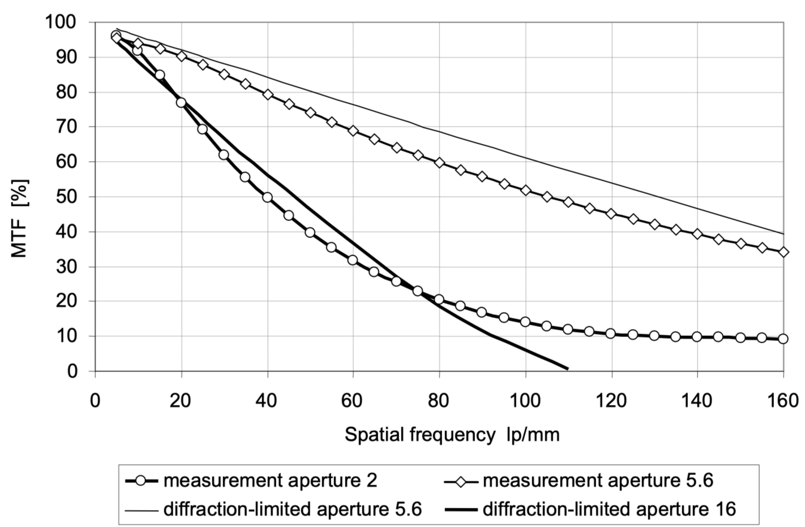

**GPT**对图注的解释如下

* **Measurement Aperture 2**: 测量是在光圈 f/2 下进行的。这意味着镜头的实际成像性能是通过在 f/2 的光圈下拍摄条纹图案来测量的。
* **Diffraction-limited Aperture 5.6**: 理论上，光圈 f/5.6 是受衍射极限影响的最佳光圈。也就是说，在 f/5.6 光圈下，成像质量接近衍射极限，表现出最佳的清晰度和对比度。
* **Measurement Aperture 5.6**: 测量是在光圈 f/5.6 下进行的。镜头的实际成像性能是通过在 f/5.6 的光圈下拍摄条纹图案来测量的。
* **Diffraction-limited Aperture 16**: 理论上，光圈 f/16 是受衍射极限影响的最佳光圈。在 f/16 光圈下，成像质量接近衍射极限，但由于光圈较小，衍射效应变得显著，从而影响图像清晰度。

For purposes of comparison the diffraction-limited transfer functions for f/5.6 and f/16 are also shown (solid line without circular dots). The diffraction-limited image is the best possible one. 

### 什么是Diffraction-limited, 衍射受限(通常用于描述光学系统的成像性能)

**Diffraction-limited** 是描述光学系统在没有像差和其他缺陷情况下，由于光的衍射效应所能达到的最佳成像质量。当光线通过光学系统（如镜头）时，会由于光的波动性而发生衍射，这种效应会限制系统的分辨能力. **衍射**：与光的波动性质有关，当光波遇到障碍物或狭缝时发生偏折. <font color='grey'>看到这个地方的时候, 我不知道光的衍射是什么, 也不知道为什么会影响光学系统的能力, 但是这里的意思, 因为这个性质的存在, 有了极限, which is 图示中的黑色实线(接近直线).</font> 

OK, 换用新图, Winfu前辈做的图真的是好, 


下面是文章的内容的直接复制(没有换成简体中文)

為了作為比較，也標示了f 5.6（橄欖綠色虛線）以及f 16（灰藍色虛線）的繞射極限的轉換函數。達到繞射極限上限的影像是理論上的最佳影像品質，在圖表上呈現幾近完美的直線，下降率與空間頻率成比例。在到達**極限頻率（limited frequency）**時，MTF趨近於０，其頻率由**光的波長**與**光圈値**兩個因素決定。

<font color='grey'>这里又想补充一点就是, 突然想到, 超过了这个原来的黑色实线(新图的蓝绿虚线,也就是繞射極限), 就会因为衍射的问题, 让成像崩了, 这样?</font> 

現實中的鏡頭即使**校正**，仍帶有殘餘**像差**，因此MTF曲線一開始會快速下降，然後緩慢趨近於０。曲線明顯向下彎折，就像上面圖６中光圈為f 2的洋紅色曲線一樣；至於光圈縮至f5.6後的藍色曲線和理論最佳値的差距就相當接近了。

當MTF曲線降至０或低於一個臨界點（Threshold） — — 例如10％，**其空間頻率即為光學鏡頭在空氣中的解像力**，這意味著一旦超過臨界點，黑白條紋的明暗結構整體變成灰色而難以辨識，這又是另一個問題。

圖測量鏡頭在光圈f 2時的曲線，空間頻率到達120 lp/mm時，幾乎是一片平坦，即使空間頻率增加，反差對比也幾乎沒有變化，這樣的測量非常不精確，鏡頭解像力可能達到160 lp/mm以上，也可能只有120 lp/mm。

這樣的判準，並不適合用來評判一隻鏡頭的影像品質。此外，空間頻率與數位時代的影像感測器（image sensor）的「解析度」，兩者也不能混為一談。


#### 像差 (Aberration)

在低空间频率下，像差影响相对较小(**为什么?**), 随着空间频率的增加，像差的影响逐渐显现(我觉得是容易变灰, 高频下间隙太小的原因)

#### 像差的类型(GPT生成)

**球差（Spherical Aberration）**

* 发生在球面透镜中，中心和边缘的光线不能聚焦到同一点。
* 导致图像中心和边缘的清晰度差异，影响整体锐度。

**色差（Chromatic Aberration）**

* 由于不同波长的光在通过镜头时折射角度不同，导致不同颜色的光聚焦在不同位置。
* 产生彩色边缘和色散现象，尤其在高对比度边缘处明显。

**彗差（Coma）**

* 主要影响图像的边缘部分，使点光源呈现为彗星形状。
* 影响图像边缘的锐度和对比度。

**像散（Astigmatism）**

* 垂直和水平方向的光线不能同时聚焦在同一点。
* 导致图像在某一方向模糊，影响细节表现。

**场曲（Field Curvature）**

* 图像平面不是平坦的，而是弯曲的。
* 中心清晰，边缘模糊或相反。

**畸变（Distortion）**

* 图像几何形状变形，直线变弯曲。

#### "其空间频率即为光学镜头在空气中的解像力"

表示在MTF（调制传递函数）曲线下降到某个低阈值（例如10%）时，对应的空间频率就是这个镜头在空气中的解像力。换句话说，这个空间频率是镜头能够有效分辨的最高频率。

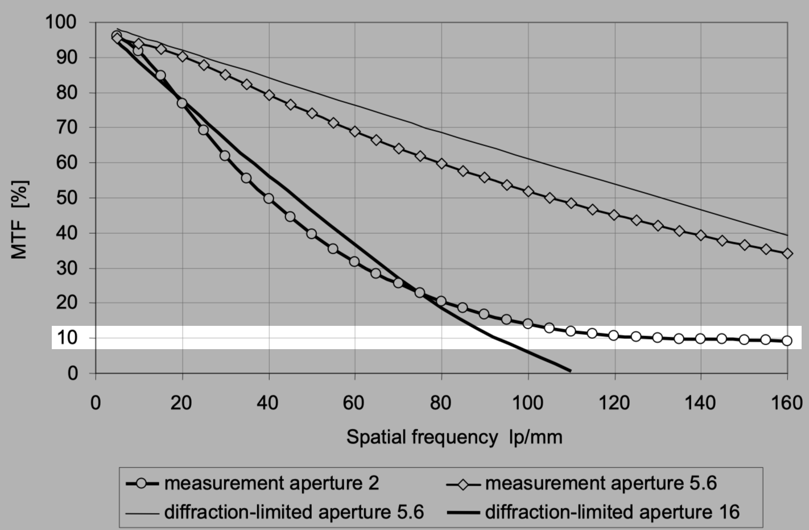

举个例子, 假设某个镜头的MTF曲线在30 lp/mm时降到10%，那么这个30 lp/mm就是这个镜头在空气中的解像力。也就是说，这个镜头能够分辨的最细微的细节是每毫米30对条纹。超过这个频率，图像细节将无法分辨，变成灰色或模糊。

下面是文章的内容的直接复制(没有换成简体中文)

測量鏡頭在光圈f2時的曲線，空間頻率到達120 lp/mm時，幾乎是一片平坦，即使空間頻率增加，反差對比也幾乎沒有變化，這樣的測量非常不精確，鏡頭解像力可能達到160 lp/mm以上，也可能只有120 lp/mm。

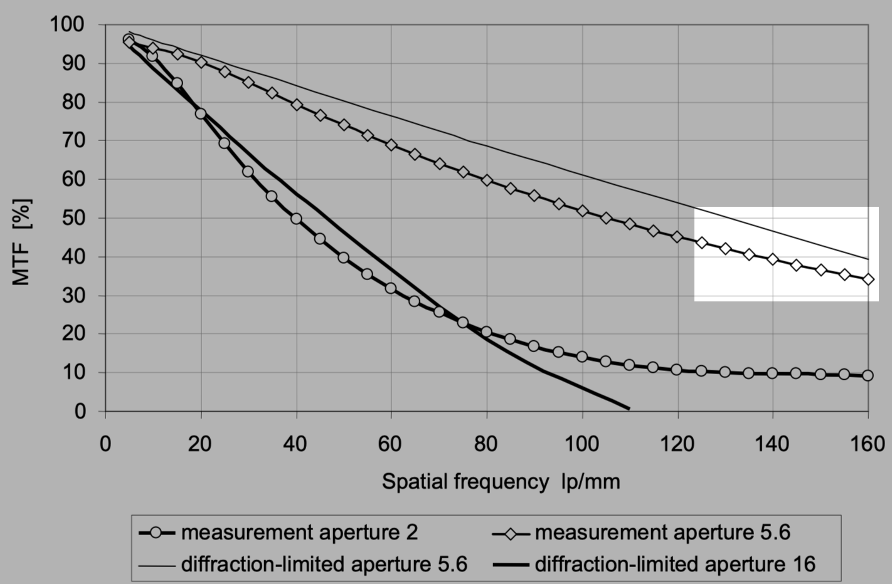

我怎么感觉文章里面没解释过下图


這樣的判準，並不適合用來評判一隻鏡頭的影像品質。此外，空間頻率與數位時代的影像感測器（image sensor）的「解析度」，兩者也不能混為一談。

這也是蔡司為何決定採用MTF來描述成像品質的原因之一。我們並不直接用眼睛觀察相機鏡頭成像，鏡頭後方總是需要一個媒介：傳統銀鹽底片、CCD、CMOS、掃描器、投影機……等等，有類比式的也有數位式的。

所有媒介（包括人的眼球在內）都有自身的影像特性，每一種影像特性也可以用一組轉換函數來分別描述。MTF的優勢在於：整體的光學成像鏈的MTF是（接近於所有）個別MTF的乘積。

Let us consider a few typical examples:

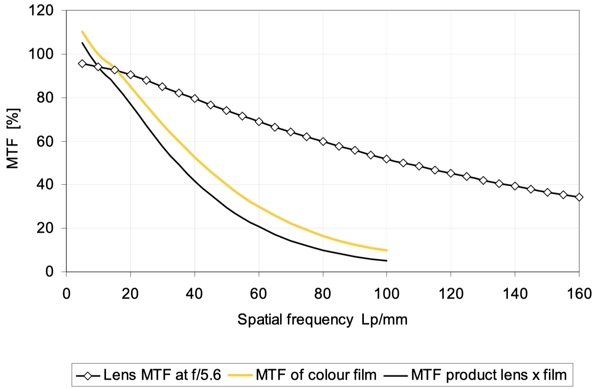

有两个图, 第二张没放, 这的意思感觉就是要注意镜头素质和传感器的素质.

Product of two modulation transfer functions: Very good 35mm format lens and color negative film. The product is always smaller than the smallest factor in the imaging chain.

In this case, the total modulation is essentially limited by the film. If one specifies a minimum of 10% modulation transfer, one must expect a resolving power of 80100lp/mm. If further elements such as projection optics or the eye are taken into account, the product is even slightly smaller.

## 在评价光学系统性能时，为什么通常不需要考虑非常高的空间频率

**理由**

在这里, 我们观察使用的是MTF product lens x film, which is 看到整体的光学系统对不同空间频率的响应, 乘积后MTF越小，表示系统在该空间频率下的表现越差。涉及更多的传递函数(MTF) 往往只会使乘积变小. 

**数码传感器的空间频率限制和实际使用下的限制**

24百万像素的35毫米全画幅格式传感器和15百万像素的APS-C格式传感器，其奈奎斯特频率大约为90lp/mm, 这是如何计算出的


同时, 40lp/mm已经足以提供足够的细节和清晰度，超出这个范围的细节对于大多数实际用途来说并不显著, 我不知道为什么. 40lp/mm被认为是一个合理的上限，因为它既能够提供足够的图像细节，又不会受到高频混叠等问题的影响。


**Nyquist Frequency**

想起来在信号系统里面学过, Nyquist Frequency是采样率的一半, 只要离散系统的奈奎斯特频率高于被采样信号的最高频率或带宽，就可以避免混叠现象。对于CMOS传感器而言，它表示传感器能可靠捕捉到的最高空间频率。在图像处理中，采样频率是指传感器的像素密度。
$$
f_{\text{Nyquist}} = \frac{1}{2} f_{\text{sampling}}
$$


**90lp/mm（每毫米90对线对）**

每毫米有90对黑白线对


## Edge definition, image contrast

以下繁体文字内容为直接复制[5].

但是，這些「數據變化」對實際影像品質而言有何意義？當我們談論「清晰銳利」、「明亮度」、「細節解析力」時，和這些數據之間有什麼關連？

我們拍攝的主體本身顯然不是正弦波。它們只能在實驗室中透過大量測試階段生成，使用其他目標對象進行測試，並以數學方式推導出正弦波的調變。

蔡司使用的是一種「明暗變化明顯的長方形黑白條紋圖案」的特製測試圖表，來評估相機鏡頭的有效解像力。

精細的，重複變化的圖案，僅僅只佔據我們的視覺功能中用來辨識影像品質的一小部分。重點是明暗不同亮度區域之間的邊界。因此，蔡司還必須研究MTF與邊界再現（reproduction）兩者的關係。說到這，我們不得不回到起點：點擴散函數。

然后在文章中就出现了4个图, which is由三并排图组而呈现的设计(有点绕口), 我一次性按顺序放在下面, 

1⃣️

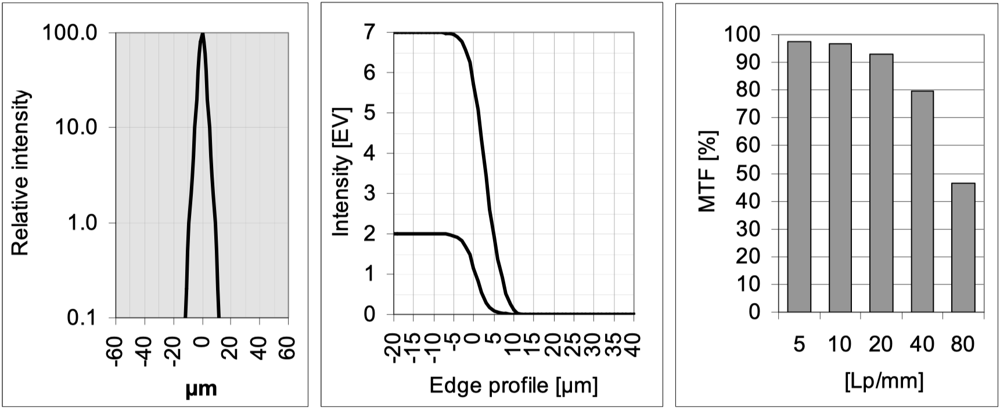

2⃣️

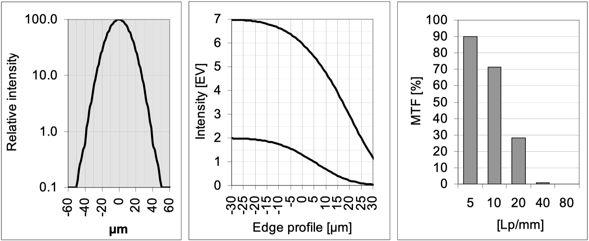

3⃣️

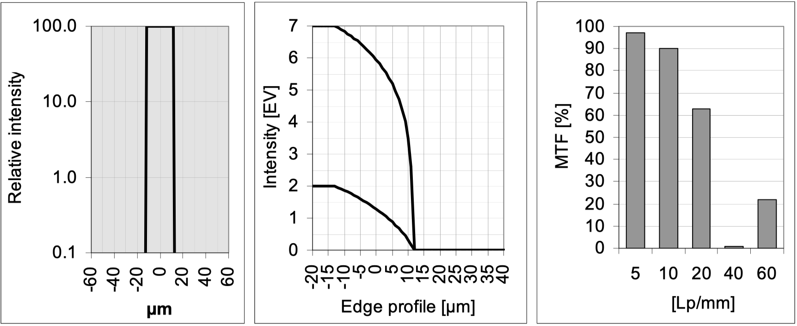

4⃣️

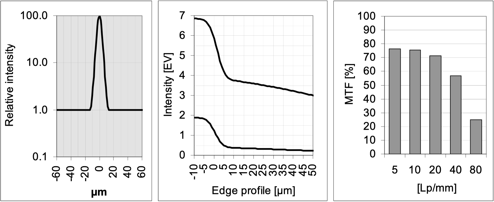

The following images show from left to right:

**Intensity profile of the point spread function**, 也就是每个图中的第一个section, 这个是光的点扩散函数, which means  that 点光源/或者说一束光在通过镜头折射穿透后, 在传感器上的分散的切面, 我觉得可以理解成底部的位置就是传感器的感光位置, 以图1⃣️为例子, 这是一个很好的镜头成像, 非常清晰, 点光源只扩散到了-20µm和20µm之间, 

**Intensity profile of two edge images**, 对于这里的Edge profile我的理解是主要关注0µm处如何变化, 还是以图1⃣️为例, 发现在0µm初变化的非常快速, 这是一个好的镜头的表现.

The corresponding **modulation transfer** 这里是柱状体描述的MTF图示, 拜文章所赐, 文章会见到不同厂商各式各样的格式,方法和规格的MTF的图片. 还是以图1⃣️为例, 这是一个非常好的MTF小图, 不知读者有没有意识到, 从5Lp/mm开始接近100%的MTF率, 到80Lp/mm下仍然保持了接近于50%的MTF率. 原作者评价$\rightarrow$ The image of the edge is sharp. In the language of modulation transfer, this characteristic is recognized by the fact that all values at the important spatial frequencies are very high and do not decrease so strongly towards the higher frequencies.

For a lens with such imaging performance, the image quality achieved is usually limited by the sensor or by other factors such as focusing accuracy, camera movements etc. 好家伙, 镜头不会限制图像的表现, 差的结果是一些客观的因素. 

下面是针对不同的图的结果分析

#### Pic 1

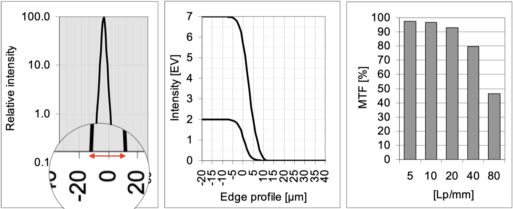

**Intensity profile of the point spread function** for Pic 1.1 

这个图在之前解释过, 可以被考虑成是一个竖直光线照在传感元件上的横切面, 可以想象成一个千层蛋糕的切面. 同时也在之前提及过, 这个数据非常非常优秀, 

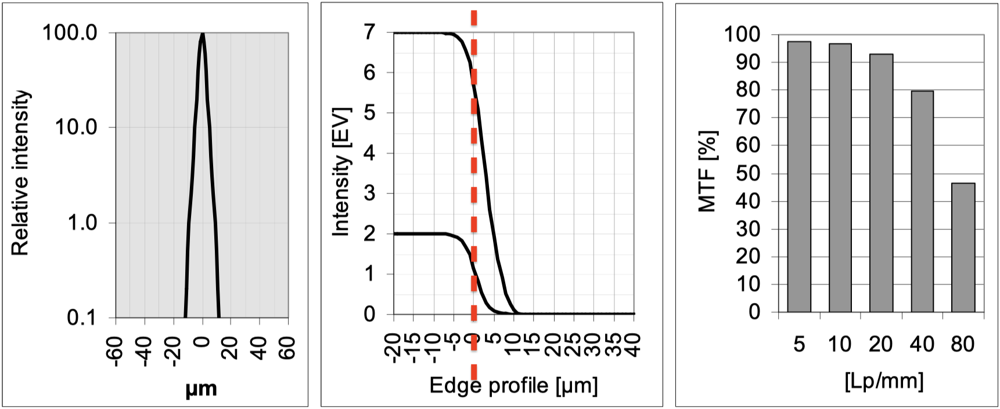

**Intensity profile of two edge images** for Pic 1.1

在之前的解释中, 没有被明确指出, 现在, 可以注意在新的图示中我划出来的红色竖线, 这表示明暗的交接线. 可以看到, lens有非常非常好的过度变化, 在经过0的时候瞬间过了,

**Modulation transfer** MTF for Pic1.1

非常非常优秀的MTF曲线表示, 在5lp/mm情况下,  正常的随着条纹更加精细而不断下降的数值, 合理而正常.

### 小注

本来是计划把4个表都解释一遍, 但是发现, 好像没有现实意义, 因为文章的意图是理解MTF曲线, 但是这种形式的MTF曲线已经不再使用. 但是在这个部分要指出的是, MTF测量表会不准, 显示 出错误的数据信息, 在文章中的例子就是, 比如现实图像在影射后, 在cmos上位移会没有显示清晰的图像, 但是位移的图像在某个Lp/mm的条纹下, 移动到了下一个位置, 导致图像没有变模糊, 仍然清晰. 虽然镜头的素质没有提高, 但是由于测试的是这种特殊的条纹, 让MTF的曲线的数据提高, 这是虚假的成绩. 这个现象在文章中被专门指出. 我在这里直接引用, **But:** There is no contrast at 40lp/mm! <font color='red'>The curve of the modulation transfer can drop to zero and then increase again.</font>  This is then called “spurious resolution”, which is a somewhat unfortunate expression because the structure with 60lp/mm is reproduced with a clear resolution.

## 文章中的第四种MTF曲线(The MTF values of this 4th type)

