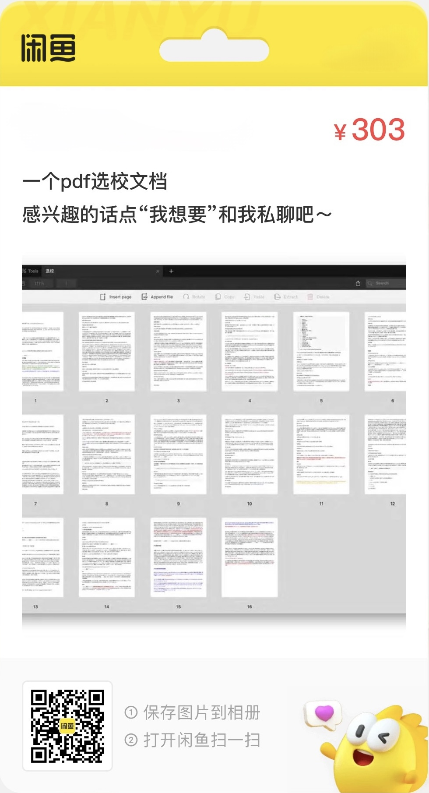

<style>
    body {
        -webkit-user-select: none; /* Chrome/Safari/Opera */
        -moz-user-select: none; /* Firefox */
        -ms-user-select: none; /* Internet Explorer/Edge */
        user-select: none; /* Non-prefixed version, currently supported by Chrome and Opera */
    }
</style>

写一些申请cs(没申到)和泛cs(cse/ce/ece/ee)硕士的想法和记录,关于学校, 关于项目, 也关于一点别的

## 开始之前

这篇文章主要记录了我在 2024 年 4 月 24 日至 5 月 1 日期间撰写的一些关于申请24fall 计算机科学硕士（CS）及其相关专业（如ce, ece, cse等）的想法和经历。随后，在 6 月初进行了重新整理和编辑。

如果你觉得语气有点怪或者某些用词很机械, 那是因为文章的原始内容被我用gpt和固定的prompt重新生成了一遍. 另外, 所有之前的commit记录已经被我删除了.


## 后记前置

这篇文章的编辑时间跨越了 4 月 24 日至 5 月 1 日，当时我正在撰写我的毕业论文，尽管那个过程非常艰难，但奇怪的是，这篇文章的撰写却非常顺畅。第一次动笔，就写了 5000 多字… 最初的草稿长度为 3.3 万字，经过初步筛选后剩下了 2.9 万字。尽管我将其简短地发布在我的页面上，但我觉得文章的口气太过激烈，因此我将其撤下重新编辑。现在，文章的字数为 19526 字（Typora 自动识别）。我希望尽快发布，以抓住大量报中介的时间。24fall的申请季已经结束了很久了，2025 年秋季学期即将开始。回顾这篇文章，我觉得这 1.9 万字更像是阐述 GPA 的重要性以及 DIY 方法的指南。

## 开始之前的开始

在申请季之前，我和一些同学（大约有 5-6 个与我同届的同学以及下一届的 2-3 个）一起交流一些申请信息。虽然交流有助于分享一些信息，但重复地讲解会很累，所以我想把整个申请过程完整地梳理一下。我开始写作的时间是 2024 年 4 月 24 日，持续到现在，即 5 月 1 日（现在是 5 月 7 日）。虽然这个过程并不复杂，但一步步记录下来便于将来参考。我可以很有耐心地向一个人解释，甚至 10 个人，但对于 100 个人来说就有些困难了。而且我也不能从中获利（虽然我想尝试），所以我想写一篇文档并公开分享，供所有人查阅。如果你觉得我不够资格写申请指南，那就笑笑、骂骂吧。

还有一点是, 我不喜欢一点一滴地讲解，一页纸写三言两语的内容，我觉得那样没有意义，内容太过零碎。每个人的背景都不太一样，所以我主要考虑自己的情况。因为我没有足够的时间和精力去了解所有的项目，也没有必要。在申请季只关注适合自己的信息是很正常的。

我考虑将部分内容放在我的主页上。我必须坦白地说，虽然我可以说自己 DIY 了一些申请项目，但我还是得到了很多人的帮助，无论是提出许多中肯建议的学长学姐，还是一位我在小红书上认识的非常厉害的朋友，都给了我很多申请季的帮助。在这里我要感谢他们。

很多第一手信息（我会全部分享出来）来自在读的学长学姐甚至已经毕业的学长学姐，感谢他们接受我这个陌生人(虽然是校友)的骚扰，并给予我建议和支持。

在申请季开始之前，我阅读了一位学长的申请总结，收获颇丰（尽管该帖可能因透露过多个人信息而被删除）。在我仔细了解了**一些**中介水平低劣的情况后，我决定自己操作申请。最终，我将整个大四上学期的时间都投入到了这件事情上。现在回想起来，我可能有点本末倒置，更应该把时间用来刷题增强计算机基础，因为相比而言, 一个排名更高或质量更好的项目对就业的帮助微乎其微，个人实力才是更为重要的。当然，实力强的人才会有机会进入更优质的项目。但是，强大的实力并非这些优质项目的教学而习得的。我说的可能有点绕，但总的来说，我在大四上花费了大量时间翻阅了Linkedln、一亩三分地、小红书、Reddit、两岸三地的 看板, Discord ，甚至还查阅了一些印度论坛（印度的计算机科学留学群体庞大，但是录取的逻辑和我们不一样, 我主要是看了一些他们对项目的评价）。这篇文章的契机是，作为西浦的大四学生，我最关心的事情就是申请研究生(可能做错了)，我想把整个过程和想法记录下来以作纪念, 也顺便给路过的人参考吧。

本人的24fall申请背景是，——删——，就这样开始了申请季。我想大部分我们学校的毕业生都会选择读硕士。就我的成绩/GPA而言，我对我的申请结果相当满意，而且项目出结果的时间非常合适。从11月开始，一个月一个ad，稳扎稳打，一点都没有慌乱和错乱的感觉。想象一下，如果你申请季最后收到了斯坦福ms ee/cs这样的offer，但前面一堆rej，你至少会失眠并不断怀疑自己半年哈哈哈。

本人的rej的项目如下

1. rej UCL sse <font color='red'>两礼拜飞速拒</font> 
2. rej uiuc ece meng <font color='red'>2月7号</font> 
3. rej ic edsml <font color='red'>一个月飞速拒</font> 
4. rej Cornell ece meng <font color='red'>az</font> 
5. rej UVa mcs 
6. rej 爱丁堡 cs & ai <font color='red'>复活节</font> 

这上面想去的项目里面, 把我给拒了的, 就是ucl, uiuc, UVa。UVa在今年更新了选课政策，选本科生的课变得非常麻烦，而且项目的规模不断扩大，所以我觉得没申请上也不算遗憾。不过，在申请季开始时，UVa是我非常喜欢的学校，本土排名在前30，但国际排名相对较低, 不过我不是很care。UIUC在投递的时候就知道不太喜欢我们学校的bg，只是因为有好几个认识的朋友在那里，所以比较想去。至于UCL SSE，投完后才发现其实根本录取不了(虽然有23fall大数据专业有申请成功的case) ，有点虚幻投递了。最后的结果让我感到意外的是UVa，我还以为是稳的… 但我已经尽了全力去做能做的事情。其实，申请季并没有做什么特别努力或费心思的事情，只是浪费时间查找资料，尽力做好自己能做的。

在之前提过，我通过学长的帖子得到了申请的第一印象和很大的收获。那么为什么我会找到这样的帖子呢？是因为在我没有决定自己diy还是找中介申请的情况下，我先在收集信息和比对学长/学姐的相关出路和他们最后申请成功的项目。除了了解上一届和上上届的去向，主要是我想搞清楚中介的收费从2w+到5w+甚至10w+到底这个钱花在哪里。但是这个问题我其实到现在也没搞明白。

我总结出的结论是：大概有些(可能也不是有些)真的就是纯骗人吧。

别的先不说了，写作水平之低，就可以很好的判断出不专业性。我写点我知道的可能是在我梦中发生真实案例：

1. 一个案例是，在签约之前说可以提供不限次数的文书修改，结果是拖着到项目的ddl临近，才给文书材料。明天0点甚至是今天下午5点就要递交所有材料了，你就说你还改不改吧:)。还有1小时或一天就要提交了，是不是对文书有什么不满意的地方。
2. 而且就算文书看起来一切完美，中介也是ddl前提交申请居多。这可能取决于外包的写文书人员的速度。可以说问题很大，因为这个节奏应该灵活掌握。下面会提到申请的时机很重要，当然你在咨询的时候，话术就是ddl前交了就都一样的。
3. 最基本的写作水平如此，那就更加不要提选校定位这种事情了。除了已经固定化格式化的选校项目(很多项目是每年都是固定套路项目,年年报)。甚至有些小中介还没总结出这些套路项目，选择的策略更加保底。这些项目在申请季开始之前，我也觉得很牛逼，学校牛逼ranking高，项目名字看着可以/过得去。但是在经历过申请季或者说申请季开始了一半以后，就会发现他们申请的标准其实不在天上，和自己之前的认知相差甚远，甚至稍微做一下调研，就可以知道自己完全可以handle。
4. 某中介在学校和材料开放材料递交第一天，直接跨过学生本人，给教授发催促推荐信的email。然后把这个教授惹毛了，在学生和教授 meeting 的时候,这个学生直接被教授警告(比较罕见的case)。
5. 语言成绩出问题。我知道的时候简直笑死了，雅思6.5的成绩在申请系统上写了5.5，甚至还有忘记提交成绩证明的，我只能说…
6. 文书全GPT(其实没关系)，开头名人名言，人和名言在Google查不到(感觉这个还是有点关系的)。笑死我了，太离谱了。
7. 还有把不同项目的语言要求搞错的,还有gre战士。人均建议：均分低考个gre/均分高补个gre，笑死。

**<font color='red'>以上案例(可能)纯属虚构，仅为说明目的而使用, 你可以认为来源于网络。</font> **

没有以上多项问题的发生，我觉得这只是做到了一个合格的中介的基础水平。因为这完全不包括对项目的详细介绍(我会在**选校**细谈)。虽然项目官网会提供很多课程的介绍、选课list，但是每年开什么课、选课限制、是否可以入读之后转专业这些内容比较难获知的, 而且这些信息每年都会变化。我猜测很多中介对项目的认识程度，和刚考完大三期末考试点开项目主页的随便看看的你，是差不多的。绝大多数的认知来源是点开项目介绍页面的直接翻译。有些中介在沟通和后续合作的时候搞得很忙的样子，我都不知道在忙些什么, 可能在忙着庆祝了。

另外我提供一点猜测，就是中介的文书工作，应该大多数是由外包完成的。这个原因也很简单，如果你是boss的话，会养一批人只在每年的9月到1月工作剩下时间休息半年么。我认为这样的成本是不可能接受的，可能养1-2人还行。然后，我搜索了一下各大招聘平台对文书老师招聘工资是5000+一个月，假设这个文书老师的水平非常高超，可以做到收入5万一个月，那么大家可以仍然感受一下，一个人在一整月的工作量可以服务多少当年当季申请的学生。

以下还有几点中介为什么会存在的一些思考。

8⃣️中介服务重复购买率很低，申请的渠道靠校代和潜在的校代口口相传和广告曝光，被发布的好评只会如潮。就其实我觉得很多均分高的人，最后有一部分人没弄明白为什么自己申请的结果不错。只要观察一下身边均分不是很优秀的朋友/室友，就可以发现这帮人有时候没有帮倒忙就真的谢天谢地了。另外，差评的传递渠道不透明，很少有人花几万买了一坨屎还到处说(除非真的吃了好几坨实在受不了), 匿名平台说一次得了。而且就购买一次，都没什么横向比较机会，还能被怪自己bg低。

9⃣️重复第8点，面对褒贬不一的前路面前，会有自我修复心理。出现“我肯定是比较特殊的一个”和“他们服务我的话，肯定会用心的”的错觉。其实每个人都是平均的韭菜。

🔟宣传得很厉害的东西，基本上都不太专业或者很一般。很简单，人的经历是有限的，当把很大一部分精力放在宣传的时候，剩下的精力就很有限了。

我们总是会美化已经被固定发展了的道路，类似于‘来都来了’。

当然，以上这些都是最坏情况（或者说正常情况），我也知道很多朋友通过中介拿了很多不错的offer。因为公司只是平台，你可能会遇到很正常相对靠谱的人来对接，就像同样一个课，不同的老师上，评价也不一样是不是？或者同一个老师，每年上课也有评价的偏差。要是每个人通过中介都全聚德，那这个行业还有没有存在的必要了（也赚不到钱了）？

但是有两点要澄清，什么是不错的offer和为什么要中介。对于后者，我觉得大部分人的出发逻辑是

1. 专业的事情交给专业的人
2. 省心

事实证明，出发点虽然正确，你抽到负责的人往往是运气。以运气为开头的故事，往往不能省心。如果申请美研，这个抽取运气的成本是5W+人民币，我觉得不太值得。而且我相信大家学到现在，稍微努力一点就可以比大部分在这个行业中*了多年的人更加优秀。

## 为什么CS/EE专业要对留学机构说NO

总来说，按严重点来说，选择中介就像是你在学校邮箱中疯狂轰炸的垃圾邮件中挑了一个代写在完成你本科阶段比较重要的大作业（当然有机会碰到某些学校在读博士水平的代写）。我假设大家来xp可能都是希望读一个还不错的研究生。虽然根据身边的统计数据，我校的本科的直接就业率在提高，认识的朋友已经有好几个直接工作和不读研究生了。

1⃣️先交钱的逻辑。如果module leader告诉你，在大四这个学期开始时，你已经有60分的保底分数，你是否会觉得有必要认真学习课程内容和完成作业呢？同理，你在没有开始申请季之前，签约合同，已经付出了金钱的代价，机构已经拿到报酬了，你申请到斯坦福本身对他来说有什么实质性的好处吗？换个说法，你FYP完全不写，不用提交任何内容就有60分的前提下，你会为了写一篇目标是发SCI的FYP文章而努力吗？奇怪而疑惑，但是可能真的有？

2⃣️抽奖逻辑，你碰到一个好的对接的人，是完全抽奖的，之前提过。

3⃣️美研，或者是申请研究生吧，绝大部分项目（我感觉看中research的项目，我校几百人最多也就是3-4个吧，甚至好几届才能出一个），申请的条件就是**GPA+学校背景**，文书和视频写/录成屎申请成功的概率也很大，一本万利的买卖，或者说0本万利。

好了，前面都在说消极的内容，但是我觉得现阶段大家要关注自己以后想干什么，有自己的思路，研究生不是目的，只是方法（来源open cs），这个方法应该是自己去分析和思考出来的。

4⃣️所以，申请的项目你要了解它，不是学校和专业名字OK就完事了，这很重要，这是你申请完以后，下半年要入读的学校和项目啊，花费70w甚至150w。好多朋友申请完以后，甚至offer下了以后才开始了解这些项目，有点……

5⃣️开始对自己负责吧，申请研究生只是很小的一步，下面的发展过程有无数的步骤和问题要等着自己来操刀，从这一步开始为自己负责吧。

在申请季最后，其实感觉大部分项目中，学生很少得到就业（非科研）的顶级提升，某些hypms的项目是真的指数级别提升的，我指的是水平不够，没什么实习也能找到工作。我有考虑冲一个hypms的二硕…但是别的项目里面，最后还是个人能力大于学校title。

## 正文 (申请的步骤和操作)

#### 选择2+

作为非顶尖选手，我主观感觉就泛CS项目而言，如果费用可以保障（30w-40w一年），对于成绩在中段的朋友请果断选择2+，西浦和利物浦CS/EE的考试难度和学习强度分配，就最后的出分结果不是一个级别的。我觉得中上水平的人也应该考虑，而顶尖选手则请随意选择。这届一个ICS的top水平的朋友，给出的评价是利物浦的cs高分不能帮助top选手获得top项目的offer。从申请结果来看，85分以上的均分也不足以保证让其拿到Open CS上S和A+项目的offer，获得的很多项目都是70+和80+都可以申请的，有效果的帮助是让这些项目从**彩票**的级别变到了**冲刺**的级别，使申请成功的难度有所下降。所以，**CS** 2+可能对于本身就是极高均分的选手帮助不大（假设你ranking排名top10，前1%？）。但是我觉得大部分人都不是顶尖选手吧？所以还是把2+推荐给大部分人 :)，4+ ICS的申请结果也相当不错，我CST/EST/DMT认识的朋友都和我说，在国内非常非常累而且出不了分（很难受），（大三下学期期末的时候前两天还刚做完pre，结束后，在一个礼拜内开考整个大学生涯中最重要的4-5门考试（真感觉就我校申请重要性来说，大三=高考））。

我平心而论，如果没有2+，然后超级努力地学，国内估计大三就… 而利物浦这里呢，我大三刚刚来的时候人整个都没怎么进入学习的状态，最后一个月圣诞假期的时候才开始学的（真摆），最后考的还可以（不同的学科不一样，我说的CS）。我告诉他们我在这里学习的状态和分数的时候，我感觉他们难受得想跳楼。利物浦大三下有点难，难度和课程压力都上来了，EEE还有Year 2 project耗费你的大量精力和时间。我做这个项目的时候出了大问题，每天都是图书馆半夜3-4点回宿舍，早上10点左右强迫自己醒然后开始做。最后评分导师也有问题。哎～CS也逃不掉，COMP208基本是一堆70+80+均分的人在这个课上非常容易得60几。而且利物浦在最后考试的时候有至少两个礼拜的时间复习。适合很多高水平选手，一个礼拜学完，一个礼拜刷完往年卷，期末轻轻松松拿80+的分数。

所以这样看，即使是这样，我还是感觉2+还是远比4+容易得到分数。自己权衡…苏州（国内）吃的是真好啊…

而且今年真的超级卷，利物浦的eecs/cs的最高分应该都是打破的记录了，英本大三engineer搞到90多分，太牛逼了。

（以下内容和**录取的逻辑**有点重复，但是主要是中外合办一波分析，你觉得不对就是你对）

其实, 中外合办的本科都希望本科生留在自己学校交学费，但是又明白没外国母体学校的reputation自己什么都不是，所以都藏着掖着推出一些bridge政策。其实说到这里，西浦基本是国内2+2政策最宽松的学校了，WKU不了解，隔壁宁诺想2+2在高考录取的时候决定一大半以上的人数，剩下的人数由4+0的人在专业里面排名决定，搞得和保研一样。成绩在次等还想去UK就有折中方案，选择只去UK交换大三一年，还有就是放弃宁诺（国内系统）的学籍和学生身份直接transfer到诺丁汉。这些操作在疫情前比较火热。之后直到现在，来或者不来，成为了他们一个权衡的选择。LGU的水平在common的认知上，肯定是比我校的reputation要高的，而且在商科金融的领域我们学校就业水平碰瓷不了一点。但是LGU的GPA太恐怖了，卷的人又多，一旦GPA掉下3.5，申请季就会非常被动和煎熬（但是在515之后有改动？）。所以我发现他们学校的common的申请结果没有很耀眼。之前LGU和CUHK出了2+2的项目时候，公众号发了好几波广告，我点进去看了看名额40-50个人...(更新: 现在又看到了cu和cuhksz的3+2项目, 感觉有点东西啊) 关于昆杜和上纽，我了解到，DKU到Duke交换政策比NYU Shanghai的限制大很多。Duke交换只能拿J1签证。这两个学校的top ranking的人出路太璀璨了，MIT CS直博/MIT FIN，申到的项目我看都不敢看，但是一旦在这两个学校卷失败，出路立马掉到rank中档的西浦宁诺级别。广以体量太小，出路也很好看，但是都是基础学科（化学，生物），我校的基础学科出路也同样很吓人(yale/cmu/nus提前批/一堆ic)，所以不知道怎么评价，加上没空了解。

还有转美本的问题…这个section太大了，可以写一篇文章来整了。但是, 如果人生有重来我一定希望是可以读美本 😭

### 处理挂科

首先没有我挂科, 虽然我现在大四分数在挂科的边缘… 我感觉我好功利啊, 没什么用的分数我一点学的兴趣都没有. 一直有2+可以免去挂科标记的都市传说, 这个被证明是正确的。在利物浦拿到西浦开出的成绩单开始给你办2+的手续时候, 他只关注分数而会忽略考试的次数, 所以补考的remark会被消除。但, 是不是在申请的时候有大用, 我不太清楚, 因为在申请的时候大概率要提交两个学校的成绩单, 还是会被发现是补考成绩。而且我感觉(只是感觉)只要补考成绩高, 就没啥关系, 申请的时候问题不大。我之前一直不敢想挂科补考的问题, 西浦毕竟不能重修更新GPA。

不过挂科千万不要慌, 申请应该还是按照第二次考试的分数来计算GPA的, 所以, 不要感觉天塌了。我甚至觉得在考个41, 42不如挂了补考算了…

6.16 update: 有人来咨询看了一个有补考成绩的transcript, 对面不说我根本没发现是补考的… 这个*的标号实在的太小了, 我现在感觉补考完全没关系了, 有补考成绩申请一般的大概原因是有补考成绩说明总体成绩可能一般, 但是有1-2门补考成绩(补考分数高), 别的module整体分数尚可的话, 应该是完全不会影响申请的. 

### WES认证

<font color='red'>7月全出分的时候,马上可以开始做了,要处理一个月,请避开9月,10月旺季</font>, 因为在10月开始做wes认证, 可能要一个半月的等待时间。想想一堆项目的ddl就是在12.15, 还是不要这么这么急的做事情吧。Ps: 虽然我也不知道wes在忙什么,可能是海专精,一杯coffee一个下午挑20个人开始算成绩, 然后下班吧hhhh。另外, wes选便宜的套餐就行,我选了300美元那个, 小亏。还有一个要提及的点, 就是大三的全学分的课要更加精贵一点。大一大二会是5学分呈现, eap掉到3学分, 但是大三正常 full credit 的课程 wes会从15学分down到5.5学分,然后7.5 学分的课还是down到2.5学分. 不知道利物浦大三的成绩单是怎么处理的, 听说还有传媒的朋友在利物浦有30学分的课,我真是一头雾水。

### 提交什么成绩(美国)

在投递的时候, 我们会在院校背景的label写自己的就读经历。这个时候, 请务必写自己转换成wes的3.x/4的GPA, 不要写自己英国记分制的成绩, 因为第一遍初筛的时候, 设置的条件的就是GPA从高到低排, 大家都是3.X, 然后你的分数80+ or 70+在那边, 就很搞笑。当然你可以说, 美国院校会自己convert, 确实, 但是你不知道他们是怎么转换的, 比如就我知道的有些加州大学会统一对英本的GPA做3.67最高处理, 或者可能有些学校, 学校会挑自己喜欢的专业课计算。这些是我们不能把握的, 但是<font color='red'>请把握你可以把握的部分</font>。甚至有些学校不知道我们使用英国的打分系统, 这里想起来一个之前我校转学本科的同学, 70多分被学校算下来GPA 2点几, 就这样无缘无故和某校(好像是uiuc)说再见了。而你可能觉得是自己软背景不够云云。虽然出现这种convert问题的可能性比较低, 但是你为什么要让它出现呢?

又可以补一点内容,我发现可能大家不知道成绩单提交的格式, 正确的格式是: wes的认证报告 + 利物浦成绩单 + 西浦成绩单(自带Classification说明) + 利物浦对成绩的Classification 文件(这个文件我附在了下面代码框中), 然后做成整个一个pdf文件。可能是多此一举, 反正这个操作的理由也是同上, 我们把握可以把握的部分。

```java
https://www.liverpool.ac.uk/media/livacuk/tqsd/code-of-practice-on-assessment/appendix_I_2010-11.pdf
```

### 关于学分(没什么用的冷知识)

在之前的section提到了就补充一点吧, 学分是每个学校的一个毕业量表,怎么说呢,大概的计算逻辑是修满多少多少学分可以毕业。其中中国高校好多是使用2.5/5这样来定义半学分和全学分的课的,西浦也是。但是利物浦使用的方法是7.5/15的组合。之前有考虑过申请欧洲的项目, 所以也了解过欧陆的学分设计, 他们使用ECTS(European Credit Transfer and Accumulation System)这个机制来计算学分。如果想申请欧陆的学校,在计算课程匹配度的时候可以参考如下, “Students should note that ECTS credits are considered equivalent to half the value of Liverpool credits, e.g. 7.5 ECTS credits would be equal to 15 Liverpool credits。”

```java
University of Liverpool. April 2024. Academics. Retrieved from https://www.liverpool.ac.uk/global-opportunities/inbound/study-in-liverpool/academic/
```

但是利物浦的成绩单上保留着西浦的学分逻辑, 2.5/5和10分的eap与7.5/15的大三分数, 让正常人计算的时候摸不着头脑。

注: 我这里真的想说宁诺西浦争了这么多年,就成绩单这件小事可以看出,西浦已经输了,宁诺的成绩单和英诺的成绩单title一模一样, 加上学分完全按照ECTS设置, 只有campus不同的标注,会写上China/UK。就西浦和利物浦的成绩单,这一看就是两个学校,title,格式, 计算系统完完全全不一样。最搞笑的是,利物浦成绩单上赫然写的大一大二分数从下交(西交大)修来的,太搞笑了

就申请上的体感也是, 两校没有绝对差距, 但是诺子好像就是过西浦半个身位…

### <font color='red'>Email</font>

我之前国内用Outlook, 国外用Gmail. **无论如何, 请重新注册**一个!!!!

首先NYU和NEU的广告就能烦死你了, 要是用老邮箱, 原来的subscribed的各种广告邮件也能烦死你(我有很多商店的邮件).

也防止错过录取通知书的ddl,真有人不关注然后中介也没发现就错过了一个学校发了的ad, 要是是梦校offer你找谁哭呢。 我不喜欢163, 要手机验证, 而且邮箱link数学符号完感觉很奇怪, 有理由相信美国人也会觉得很奇怪, 之前在英国打客服电话的时候用163邮箱对面都笑了。

之前没想到要写这个section, 算比较重要和简单的一步? 因为我知道看到过一个帖子, 某校学生没发现学校发了offer导致gap的, 记得那个家伙是LSE的项目。

#### 语言

我的语言水平一般, 所以直接waive了, 好像没怎么影响我的申请, 除了NTU CCA发邮件问我要语言成绩。

#### GRE

我在这里专门列出。 

有时间,喜欢英语,有自信的人可以专门考一下。 我高中的时候, 刷知乎看到一个北大本科说考GRE很痛苦,太痛苦了,感受到了单词如水流入脑又如瀑布般流出记忆,笑。

但是这个现在已经不是必须的了,甚至申请的权重越来越低(我给出一个猜测,重要性占比为2%,给1%太少,给3%太多),我真的感谢那些GRE作弊哥, 以一己之力让中国大陆的GRE平均分在疫情的两三年内实现了史诗级别的跃进, 让这个考试的效力越来越低。 别人花钱我来享受这个结果,拯救了我这个英语渣子于水火之中。 总之, GRE的不考率真的是越来越高。 除非是top项目, 否则院校真的要考虑是否用这种姿态来换取申请数量的下降(说的就是你, NYU,9月GRE required然后10月改成optional)。

但是,GRE能考出的大佬还是挺牛逼的, 我深深的respect!!!

哦对了, 如果想申请CMU的一些项目好像GRE是必须的,有些顶级项目也有GRE的要求,比如CMU SCS/ Yale CS/ Duke MSCS, 但是我目测西浦大多数人申不到, 本科院校背景不够。

总结, 就近两年的EE/CS申请而已,市面上90%的项目, 已经不需要GRE了, 或者换句话说, 剩下的10%的CS/EE项目不属于西浦, 无论是 斯坦福 MSEE, CMU SCS, Yale CS…注意除了CMU, 但是我申请季完全没考虑CMU, hhh

如果对于自己非常自信(有我一个浙大的朋友0基础学一个礼拜325+的case😭), 那可以考一个玩玩, 但是你一旦感觉是自己要下定决心努力学习GRE才能考的话, 相信我请直接放弃, 这个时间放在准备大四的暑期实习/秋招, 会对申请后的发展/对找工焦虑的解决大有益处. 收益远大于10倍的一个GRE 330+的成绩。

#### 卖惨

我见过很多在文书中卖惨的案例，例如身体残疾、父母离异、心理疾病、性别认同问题，甚至简单地描述自己是第一代大学生。虽然这些情况都可以提及，但重要的是表达时要有逻辑。在美国，强调英雄主义，因此指出问题的同时，请务必说明你是如何解决或正在解决这些问题的。例如，家境贫困、没有足够的经济支持读书，但却凭借优异的成绩获得了奖学金，一路走到今天。注意要有起承转合的叙事逻辑。如果你只是简单地陈述了困境而没有后续，那实在对不起……你是在说让赚钱的master项目给你提供励志奖学金吗？

因此，在个人陈述或申请书中提及困境时，请务必简要阐述困境，多加说明解决困境的过程。如果这些被注意到(几乎不会被注意到)，那确实会给你加分。

#### 情侣

有些学校, 在申请系统上会问是否情侣/朋友一起入学(主要是私立学校), 我觉得这个点是有影响的, 逻辑是如果两个人都满足入学要求, 学校给这两个人发offer入读的概率就会很大, 减少担心发offer被鸽的情况。 所以你懂的, 既然有离婚买房, 那么申请季在申请系统上小结一下好像也不离谱 。

#### 科研&实习&作品集

我申请下来感觉90%的项目没什么用，9%的项目有些用，1%的项目则非常重要，可能是因为GPA较低（3.1），但有着丰富的实习经验、参与过的会议和发表的论文。也许这样的申请材料会让招生委员会感到困惑，谁知道呢，这些东西总比没有要好，但重要性远不如GPA高。找到这些项目需要耐心和规划。

然而，有质量、有含金量的实习对于未来就业和申请绝对是有帮助的。尽管在申请阶段可能帮助不大，但在找工作或实习时会大大加分，没有实习经历的人必然会吃苦头。尽管这个世界有时候确实挺滑稽的，为了实习你首先必须有实习经历，我已经有很大预感我会吃苦头了😭。

关于Kaggle的更新：我听说有人购买Kaggle比赛的成果，但如果你购买的是银牌，根本没什么用；金牌有点用。

虽然对大多数研究生项目的申请没有太大帮助，但对于找到自己感兴趣的研究方向，甚至未来职业规划来说，还是有帮助的。此外，不仅局限于科研，比如骑车、徒步、攀岩等，在大学阶段探索自己的兴趣对个人成长也是很有益处的。

#### 录取的逻辑——为什么GPA如此重要

我突然意识到前面三个小节都在谈论GPA。为什么呢？因为硕士申请的逻辑实际上就是看学校背景和GPA来筛选申请者。我一直在想西交利物浦大学（XJTLU）的学校背景大概在哪里。就陆本来说，西浦的定位大概在中上211和非顶尖985之间，比如重庆大学、湖南大学，最顶尖能上到中山大学(已经很强了😭)。最强的uu，我认为可以上到华五水平的25%左右（华五就是第五, 有个跌三观的认知是在申请水硕上面，xp的各位可能比复旦的很多普通人有优势，很多复旦的申请者的结果可能都干不过上海大学）。当然，92中最顶尖的学校碰瓷不了一点，录取分数线非常高，比如苏州大学有直博斯坦福计算机专业的，我们学校氛围比较功利，不太适合这种all in的人才。而且据我观察，92中最强的人基本上是赢者通吃的，OpenCS A+/A的项目可以申到好几个，S也有一些，4月份开始幸福的纠结。但是我们学校的背景，能摸到一个A/A+其实就是很大成功了，已经非常不错了。当然，学校声誉的提升完全是因为我们使用了利物浦这个英本的pool，美国学校也不希望录取的学生全是中国的92学校，这样的逻辑在不同情况下也是合理的。比如为了男女比例平衡，斯坦福eecs录取时，对女生的门槛就稍稍降低一些。以上纯属个人猜测，不负任何责任。只是根据申请季的情况来看，我觉得我水平碰瓷不了这些92学校。

具体来说，GPA和本科背景是学校了解你的关键。绝大多数授课制研究生的招生官会认为一个好的GPA表明一个人在大学课程中有可以的学习能力，因此在研究生阶段，他应该仍然能够适应。然后这个逻辑就结束了。本科课程内容的好坏与申请人是否被培养以及学习的意义完全无关。因此，在申请时，如果面对一个相对较低的GPA，我们该如何解决呢？我想到的办法是申请成绩单中那些取得高分的课程突出自己的优势，并让低分课程的老师写推荐信解释（虽然让低分课程的老师给我写推荐信纯属巧合，我非常感谢在申请季愿意为我写推荐信的老师们）。开源节流，开源用高分课程突出优势，节流避开低分课程，并用老师的推荐信弥补。这可能并不是非常有效，但你可以看到下面两个链接中不断强调推荐信没有多大作用或者推荐信很无聊，但我注意到一个现象，推荐信被审阅的概率非常高，无论是被检查（查找问题）还是常规浏览，因此我们可以充分利用这部分内容。

但我觉得以上分析都是瞎猜，如果是一个几千人申请的大项目，这些信息是不可能被仔细阅读的。

这里转载两篇文章，不重复造轮子。

```java
从审材料的角度谈谈研究生申请|一亩三分地研究生申请版
https://www.1point3acres.com/bbs/thread-463109-1-1.html
```

另外一篇在小红书，作者Shangtong Zhang，UVa的24年新的AP

```java
Shangtong Zhang发布了一篇小红书笔记，快来看吧！ 😆 hlMl41cracI9LVC 😆 http://xhslink.com/Vcd5CH，复制本条信息，打开【小红书】App查看精彩内容！
下面是Shangtong Zhang的个人网站:
https://shangtongzhang.github.io/
```

为了防止上面的post被删除，我复制了所有的文本在以下的section中，如果有侵权，请务必联系我删除[notmyemailcode@gmail.com]，不胜惶恐。

```c
去年新入职被放到了graduation admission committee里全程参与了PhD和master的录取, phD的录取感觉跟我想象的差不多，但master的录取和我想象的有一些差别很大的地方，跟大家分享一下。Disclaimer:这只是我个人经历，不见得通用。而且这个就算能generalize，也绝对只适用于master不适用于 undergraduate和PhD.

总的流程大概是一个senior的大佬出任committee chair制定一个评分标准(比如用以
的)，然后若干AP被拉进committee，是具体干活的人。大佬给每个人分配任务，每个
appication package有N个人review,最后取均分。所有的application都review完之后，系主任划一个录取的分数线，done。

重点来了，我们每个人分到了大概200个application package，需要在大概7个星期内review完。所以这个任务相当重。文书？我记得我本科申请master的时候写personal statement那叫一个精雕细琢。但你猜我能花多少时间去读PS？而且PS好坏这是个非常主观的东西。我只能去看一些关键的点(具体是什么我就不方便说了)，你英语写的再
fancy，句式再高级，故事再telling，我也没空看。我觉得你有typo我都不一定看的出来。

本科学校 vs GPA? 我一直以为本科学校会很重要，比如一个复旦的总得比蓝翔的得分高一点吧？但我问大家一个问题，印度除了IIT之外最好的学校是哪个？IIT的这些校区哪个好？伊朗最好的学校是什么？但GPA是一个很客观的number，只有地球人都知道的好学校才会有额外加分。而且学校好坏也是一个非常主观的东西。

推荐信？这个相信大家都知道，推荐人对细节的描述和跟peer的比较最重要。我见过的最搞
笑的是一个人有三个letter，但这三个letter除了签名完全一样。。
暂时只想到这些，如果大家有问题欢迎在评论里提，能回答的我会尽量回答。其实很多问题
只要换位思考一下加上下面几个fact就很容易得到答案。
(1)AP都很忙
(2)隔行如隔山 
(3)越主观的判断越花费时间
(4)读Master是要交学费的

有评论提到CV和SOP哪个重要，之前忘了写了，我认为CV远远重要的多，因为从reviewer的角度看，从SOP获取信息太麻烦了，CV就简单很多。
```

 

**以上是我对美国学校录取的总体认知，当然还有很多细小的点, 在下面的section中想到哪里讲到哪里, 每个subsubtitle没有明确的连续上的意义。**

#### 英国+欧洲

说到英国，感觉信息有点碎片化。学校列表、均分等信息都有，甚至细分到一些特定项目的学校列表，有些过于零散。

比如剑桥，有针对不同地区的院校列表，比如对岸，台湾的清华大学和交通大学，还有伊朗的Sharif理工大学，土耳其的Bilkent大学。这里我想提一个有趣的小插曲，有人申请时把浙江大学(zhejiang uni)写成了镇江大学(zhenjiang uni)，结果收到了拒信。这个信息是通过申请人向拒信方发邮件争辩后得到的。说到学校名称，之前KCL还是UCL在发布中国学生的背景统计时，XJTLU的全拼缺了a少了d，真是挺搞笑的。

想提一嘴ETH, 这个学校非常非常神奇和清高, 和大多数学校不一样的list操作,这个学校有一份内部的reputation网站, 按一定时间更新, 我还查到了这个网址, 但是只有ETH的在读phd, 访问学者,ap, professor可以access, 看不了一点. 这个文档会记录下, ETH的学者和各个大学的学生,phd,教职的合作后的评价,  我猜大部分应该是主观的, 正向的,我是是指留下的评价. 所以,如果你校是blank的,或者说remark的条数非常非常少,那么就很寄. 希望以后我校的uu们可以解密这一份文档. 

对于欧洲，大家可能比较感兴趣？我一度对欧洲很感兴趣，但最终放弃了。除了瑞士双e和KTH比较难录，还有一些其他学校的cs是比较好申请的，比如丹麦的奥胡斯大学、瑞典的CTH、林雪平和KI（诺贝尔奖颁奖学校）、荷兰的阿姆斯特丹、代尔夫特理工、埃因霍芬理工、意大利的都灵理工、芬兰的Aalto和赫尔辛基大学。

在申请瑞典的学校时，需要注意项目的优先顺序，不是平行志愿。在申请系统上，瑞典的不同学校的优先次序会影响录取结果，简单来说，不是平行志愿。

另外，今年好像是Erasmus计划或者EIT计划的最后一年。如果不了解的话，这些计划可以让你在一年内换两到三个学校，可以获得奖学金。中期的时候, 奖学金发放得很慷慨，但考虑到搬家等问题可能会有些麻烦。

我最终放弃欧洲的申请，主要是因为受不了北欧的天气。其实我已经注册了瑞典和荷兰的系统，选好了学校，都到了最后一步，但最后还是放弃了。因为我觉得我很可能不会去，那这样做只会浪费我的精力。在申请季节，我浪费了大量无意义的精力，包括写这篇文档。

#### Cashcow的逻辑

匹配很重要，包括分数、GPA、申请背景等，其实缘分到了就录了,不然为什么叫抽奖呢,喜欢的都投, 万一扩招了呢。

硕士本身就是作为“cashcow”来消费的。请买得起的最绚烂的珠宝吧，即使买不起，也要试试（提交你的申请）。

大部分硕士课程的逻辑是，学校有声誉和好的课程，你进来后提升实力，然后你交学费，学校赚钱，你毕业后进入中国或者学校所在地的工业界，为学校赚取声誉，使好的企业和组织认识到这个项目/学校的优秀，更愿意招收该项目的毕业生。学校在你毕业后会利用你的人脉和就业情况作为背书，以吸引更多的“cashcow”，earn buck for research ,phd, facility, but not for U.

#### 后置（更新，update）提交材料

在申请过程中，有些操作是后续进行的，比如雅思成绩单后交、成绩单更新等，在提交申请后，最好只多做一次。美国的申请系统，很多由外包公司制作的，有些系统每次新的提交都会导致之前所有材料的重复。我认为你可以将其理解为数组的复制，当数组已满时，添加一个新元素会复制原数组再寻找一个新地址来存储。想象一下招生团队在阅读四五份重复材料时的表情吧。推荐信应该可以后交，没问题。虽然也有评论表示，这种更新不会导致材料重复，但很多学校也声明了更新后的材料基本不会被考虑。因此，在这方面我建议最多只更新一次，包括写作样本、成绩单、语言材料等。不过我自己也更新了好几次然后也收到很多学校中的梦校录取了

好像这个section有点乱，我也搞不太清楚, 不懂了,搞不明白。

#### 申请投递的时机

时机的重要性,说实话我在申请季开始之前完全没意识到, 后来才发现这个的<font color='red'>重要性就比gpa差一点点</font> , 时机非常重要。

举个例子，西北的CE专业较早投递会相对容易些，越晚越难。

再比如，NYU一开始9月要求GRE成绩，但后来发现不太好招到学生，一堆其他比NYU还好的项目和学校都不需要GRE。

NYU的雅思要求相反，我12月申请时豁免了雅思，1月我offer都下了, 但朋友1月卡DDL提交申请时，NYU因为申请量过大而取消了豁免语言。另一个例子是NEU的不同校区，基本上是先到先得，晚了就要转校区了。当然，也有例外，比如NYU的CE项目在DDL后仍有人被录取。

时机还包括申请的项目新旧, 相当于打新, 你要是上车了一个一开始bar低,后来水涨船高的项目,那就很赚.

时机还与历史经验有关，利用上一届的案例来定位自己。这种做法通常很好，因为基本上八九不离十，但也不是十全十美的。项目本身会有细微的变化, 比如rice mcs这个项目, 在22fall 时候gre required, 但是在23fall 改成了highly  recommend, 然后23fall拒绝了所有没有提交gre成绩的人. 类似做法在23fall还有brown的cs, which在24fall就不这样了.  本人超级后悔没申请rice mcs…这里的时机指的是参考历史经验，但如果真的对某个项目很感兴趣，一定要申请，不要因为觉得会浪费申请费而放弃。

#### 投递数量策略——海投

两个字, 海投. 甚至是多国家投, 多档次投, 多rolling投. 投Dream school, 也投认真研究后的保底

在上一个section我有提到, 申请的时间非常重要, 申请2-3个项目, 一旦这个这几个项目今年的招生计划, 对学生的bg品味有较大幅度的变化, 那你就寄了, 所以使用海投来规避风险是较好的策略, 我之前在xhs看到过一个申请季推荐信的神, 是一个211本国内研一的bg, 在23fall申请季申请了40+个项目, 真牛逼, 我是说推荐信数量. 我记得最后去向是uw pmp. 

#### 不吝惜申请费用

多花这个钱, 我就踩坑了, 想着这个肯定申请不上,然后就扩招了, 申请赌徒应该付出全部的钱买全部的筹码, 给大家建议是应申尽申, yale harvard等，不妨多花钱提高申请几率。当然，申请费用总计1.5-2万元人民币左右（我的申请费用应该在7000多人民币），申请20所学校应该就够了。如果觉得心疼申请费，可以关注学校的申请活动，有时会提供免费申请码。还可以考虑加入一些美国的学术组织，有些组织的会费大约20美元, 就可以免除多个学校的申请费用。

#### 硕士(MSc)与工程硕士(Meng)

在申请季节，有些人对这两个学位的区别很在意，尤其是在想继续申请博士项目时。但我个人认为区别并不大，更重要的是关注项目本身。项目之间的差异才是更值得考虑的因素。对了在UK, 这两个确实有区别, meng有看到ucl和Bristol本科可以直升硕士发一个meng学位. 但对于外校的本科生来说, 卖的一般是MSc学位, 这点确实有一定区别，国内就业这个点几乎不关注。另外，还有一个有趣的news，剑桥大学本科毕业后5年或7年（具体记不清了），学校会直接授予一个艺术硕士学位，这是不是很有趣呢？

#### 论坛及社交媒体

各种论坛和社交媒体(xhs/地/知乎/留学圈)都是很有用的平台，但要善于筛选对自己有用的信息，尤其是不要被一些过于优秀的背景所影响。

#### 项目的招生规模

之前很少有人在申请时考虑一个项目的招生规模，但我觉得这是相当重要的因素，它反映了学校的培养态度。是真正用心培养学生，还是只当他们是cashcow？大班授课的体验我们已经有所了解，一个教授面对200个学生，讲台上游走，学生们人山人海一般。我曾看过耶鲁大学的一个社会学公开课，每个学生坐在圆桌上，教室里不超过10个学生，教授在中间讲课。我想这是我一辈子都无法体验的了，但这反映了一个问题，学校是如何对待学生的。许多质量好的项目通常班级规模较小，10人以下算是小规模，20-60人左右是正常规模. 但是近年来有, 200人甚至400人以上的项目，虽然这些项目和学校也很好，但我个人不太喜欢。读完两年书，同学名字都认不全，这不太像是来上学的感觉。我交了学费，教授你至少也该用心点吧？虽然学费不是直接给你的，但是我交学费是在为学校的建设和研究项目做贡献。虽然上课本身并不是最重要的，但是我觉得至少应该提供一个合适的学习环境。

#### 一些小建议

在申请的项目都ddl之前, 不要交流各自申请的项目. 保护自己也不影响他人. 你自己要是90分,在ddl之前, 和一个70分的人去说我申了什么什么项目, 这不是给人上压力吗…项目很多都是同校竞争, 同校同专业竞争, 所以大家都安全一点呗. 但是在ddl之后交流, 就不会出现这个问题, 原来大家眼光一样,我感觉还挺惺惺相惜的. **人总是在美化自己不能改变的事实, 那些已经过去的东西.** 其实就算这样都发现很多撞申请的, 你应该不想进了一个项目最后发现可以开一个50个人的西浦校友会吧? 笑死, 这种情况比较少, 但是某个项目冲到人多, 你有可能真的会被ab掉.

#### 推荐信

推荐信至关重要，越多越好。早期建立联系，及早联络。如果自己撰写推荐信，注意使用不同的IP和设备，换不同的作者身份。目前已知，纽约大学会检查此类信息。利物浦大学的计算机科学和电子工程项目对推荐信数量要求越来越严格，请多向相关老师寻求帮助。若推荐信不足，仍然建议提交一些相对一般的申请，因为明尼苏达大学、德克萨斯A&M大学和纽约大学等学校会审查推荐信不足的申请。敢于尝试的话，可以考虑一些不要求推荐信或允许手动提交推荐信的项目，但这并不被推荐，灰色手段不建议使用，但有时不得已而为之…

#### 小补: 学长的post

由于已被删除，我也不愿透露他人信息，我对这篇文章的印象主要包括以下三点：

1. 从3.7到3.8的GPA提升, 对申请的帮助是巨大的,(补充, 比如3.79和3.81是两个水平)。
2. 强大的软实力对许多项目而言相当重要（学长bg和水平我真的流口水🤤）。
3. 在录取时，许多项目存在同校竞争的情况（我补充，中外合作项目的竞争，英国本科的竞争，甚至同一所学校的竞争）。

DKU本科 2023年秋季的一个申请总结post，因为我不认识他，我直接写了，而且也删除了, 反正很难对应到一个具体的人。

1. 作者大概描述了自己辉煌的本科经历和研究经历，主要集中在金融领域（这里我真想说，DKU的资源确实独特，我顺着论文进去，惊讶地发现有10多个人均参与研究，老师甚至在英国创办了小公司，带领全组发表论文，把我这个小年轻看得一愣一愣的）不过这个po主在这里干了很多工作, 没话说, 有机会人也要中用啊, 我看到这个公司里面一半的人以上都是数据标注,数据处理
2. 一段实习经历似乎是家里安排在本地银行分行。
3. 后来的实习经历显然更为出色，水平和本科声誉在线。
4. 然后就是接近于大满贯大申请结果, 我依稀记得是, ETH, cambridge, 应该有牛津, 不知道有没有duke ece了,应该有, 这个基本是dku本科水平稍微好一点的保底, 最后去向是西北 msai, yyds。

#### 天气

好吧我又来写了, 这在选校的时候还是要考虑一下, 我在英国读了两年, 是真的浑身难受, 整个人都不好了,感觉整个心情和心态都变了很多

#### DMT

快到最后了, 简单的说一下我的专业DMT, 这个专业基本上就是一个CST, 95%相同, 但是更加不合理一点, 到了利物浦以后专业名字变成了CSEE(dmt pathway), OK我可以接受, title说完了. 说说课设, 我其实觉得如果2+的话, DMT的课程设置比CST好一些, 好在压力比CST小一些, 轻松一些. 然后DMT课程的整体设计我的评价是不知道在干什么, ee也想教, cs也想教, 还有一个虚幻的游戏track. 往年dmt的title不能吸引到大一的童鞋, 加上不能2+申请的出路比较惨淡(但是有中过Upenn cggt好像也不能说惨淡), 今年20届莫名其妙吸引到一批人,其实出路还挺好看的, 认识的人里面有Brown CS, Upenn EE, ic bme, USC CS(game dev), ic Analogue and Digital Integrated Circuit Design MSc, nu ce, Cornelltech ece meng, Duke ece. 能在dmt成绩好的话, 我觉得和cst无二, 甚至更好, 当然两个项目的课设我真是无力吐槽, cs的track没os和net, 甚至连选修课的option也无. 我整个本科阶段选修课的数量为…2节课,  year3上c++, xp大一和利物浦year2的课有大量重复的设计, 还有不知道在干什么的强行塞入的信号处理/系统, cs没什么project无数的report, 说说做游戏year2的intro game是必修, 然后就没有了, 再year3的 adv game是不可以选的… 吐槽起来三天三夜也讲不完, 但是dmt录取的门槛比cst低, 加上我个人觉得整体上dmt课程设计稍微比cst好那么一点(50笑百), 更靠近ai一点, cst没进去dmt也还不错, 只比cst输名字, 反正就这样吧. 

#### 再谈英国录取?

英国的学校, 什么项目录取了多少人,有多少人申请, 甚至可以看到按种族区分的报告. 这些可以在这个 **whatdotheyknow** 网站上找到. 但是学校是ucl, lse,ic, 牛剑,曼大, 爱丁堡这些, 因为中介只对这些学校感兴趣. 我觉得这个网站有点像论坛，很多都是同一个中国的中介(好像叫kiki)在网站上发问题，要求学校公布项目的录取数据。由于各种原因，学校一定会回复一个像样的报告，但是有些数据是模糊处理的,每个人都可以access,然后在xhs和各种地方就传开了。需要注意的是，申请量和录取人数的对照，不能客观反映项目的录取难度，但如果申请量很大，比如3000+只录取了200+人，那么项目确实是比较难的。我举一个反例，像剑桥大学的pure math part iii作为世界上最著名的硕士项目，申请量实际上并不是非常庞大，每年大约500到700人，尽管现在帝国昔日辉煌已经过去，但是这个项目吸引的申请者基本上都是来自美国本科前20中排名靠前的学校、或者伦敦大学学院/帝国理工学院/华威大学排名前3%的学生？其他的英国本科基本都需要排名第一或第二。我甚至看到过哈佛本科生来申请这个项目，还有申请成功了普林斯顿大学的数学博士然后推迟一年来入读这个项目的。之前30-40年前的part iii的毕业生基本上都是教授，总之很多有学术抱负的数学人才都在申请吧。所以申请这个项目的基本上都是数学排名第一或第二的本校学生，很多都是排名第一或第二的，你说难不难吧。今年我看到UIC和XJTLU都有学生申请到part iii纯数，真的很厉害。据我不负责任的猜测，应该是中外合办第一次接触到part iii纯数。

#### 选校(恰饭)

这个section的大部分内容被我删除了，作为有偿分享的部分。价格为303人民币（which = 我在北京办签证时候的第一顿烤肉的费用），可以在付款完成之后，将支付记录和名字发送至以下邮箱：notmyemailcode@gmail.com，使用**学校邮箱(@xjtlu.student.cn/@liverpool.ac.uk)**。提供的信息越详细越好（名字、专业、账号名字、付款时间）。我会尽量在48小时内发送文档。我只是想看看到底能不能收到钱，嘿嘿，玩一下。 

但是前景(钱景)貌似比较悲观😭.

另外这个section直接分享出来容易被人骂, 申请季已经被人上嘴脸了, 类似于“这个项目很nb, 你为什么这么说它”, “某某项目明明不错, 你为什么这么评价”. 我想说这些评价本来就很主观应该没有什么对错. 也没有说某个学校的某个项目就比某个学校的某个项目好, bar高的项目也不是肯定就比bar低的项目好, 有很多客观因素要考虑, 比如费用, 天气, 生活的城市, 就业的期望, 课程项目的压力…等等 但是选校恰恰是bar为前提的, 不然没有意义. 所以多种原因吧, 我最后决定不公开共享了, 看看能不能恰到饭和避免引起争议. 


<div style="text-align: center;">
  
</div>   

**如果购买你会得到什么?** 你只会得到一个我编辑的PDF，其中包含对许多项目的主观评价和我自己对一些项目bar的认知 (1w+字)。其实有接近60%的内容来自openCS, 不是100%完全是因为openCS上没有很多ee,ce,ece的项目, 不保证绝对正确，但是是我申请季的一连贯感受和记录。其中包含了2个2025年秋季值得打新的项目和一个录取难度较低的项目。


我觉得这个list/pdf 卖303人民币挺贵的。或者按照某些人的话说就是太不要脸了, 反正你可以理解成我不太想直接分享, 这样? 

但是总之, 选校和选项目是申请最重要的步骤, 也是我花费最多时间的步骤,因为这其实是申请季可以唯一应该稍微认真的地方, 因为GPA已经是定数了. 另外其实你本科GPA(3.0以下)完全寄了其实也有办法拯救, 花一年时间可以和西浦cs的3.8+申请结果差不多. 但是选校list还是自己总结整理比较靠谱，选一些自己喜欢的项目，和申请到后肯定会去的保底学校，这样就差不多了。

anyway，想免费拿list也OK。

使用**学校邮箱(@xjtlu.student.cn/@liverpool.ac.uk)**发送邮件到notmyemailcode@gmail.com，简单阐述一下如下主题：


**自己准备diy/已经做了什么**


好尬…我希望我的选校list可以帮助真正有用的人，而不是一边报了机构一边还想稳一手到处看看的uu，申到了最后又被拿去发一些夸张的录取广告，吸引一波又一波的新韭菜们。然后, 其实我在**后记**中放了大量的链接，很有价值。

anyway，我真的觉得我其实挺菜的。

所有的文本我会在2025年1月15日重新完整更新发在这个page上，如果我还记得的话…

**可能有些人有咨询的需求**（笑死，真的有吗），但是我暑假比较忙，就不恰这个钱了。但是可以用email沟通聊上几嘴。另外我的小红书 id是454336362。

#### <font color='blue'>提醒</font>

如果你报中介的时候发现了如下项目，

<font color='red'>UPenn ee、哥大ee、NYU ce、UW ee pmp、UCL Scientific and Data Intensive Computing MSc，其实还有很多但是以上这几个太著名了</font> 

<font color='red'>还有neu is（几乎是有认知的美国学校的stem研究生项目bar的鞋底）</font> 

那么我只能说，你的大几万中介费有很大可能性要打水漂了，因为这些项目对GPA符合要求的西浦选手几乎是来者不拒。在往年，往往年有不断尝试申请和ad的很大数量的cases。就**录取难度**来说，在保证GPA的前提下申请这些**项目难度不大**的（虽然有点太夸张了，但是夸张点说，文书不要骂学校就行）。所以如果你报了中介，可以在申请计划上删除这些学校然后自己申请得了，因为这些项目是中介赚钱的保底 :) 但是，这些项目的质量，我感觉都还是很不错的。 

另外关于offer们，我觉得，收到太多平级offer可能没什么意义，比如说，收到3个匹配，或者说3个保底. 比较好的申请结果是一个冲刺（彩票），一个匹配一个保底，所以选校的梯度比较重要，很多申请季认识的朋友除了抱怨中介useless之外，都有点后悔没有申请某某彩票项目. 其实我也是，有些项目投了不就是买个念想，不要在10年以后说“要是当年表白就好了~”，乐。

##### 什么是好项目

看美本在申请什么，去美本在去的项目，看大家是如何拿脚投票就行。也注意自己要什么，有的人注重title，有的人注重费用，有的人注重课程设计，都没什么不好的。就其实大学，还是要读出自己的想法上的路子，GPA这种东西申请完废纸一张，西浦GPA4.0社会认可度不如北大2.0一根毛。找工作也不看GPA。而且GPA也不代表知识水平高，考完一年我早忘完了学了什么，大厂也不会因为你GPA高觉得你nb…真的完全没用，导致我现在特别慌。而且申请结束后, 其实成绩已经没有意义了, 相信我真的没有意义了.  到最后，我想到了之前在大二时候看到的《上海交通大学生存指南》中的句子，作者是08年的侯晓迪，是上交低绩点直博Caltech的真神（我一直想不明白为什么有这么神的人，印象最深的一句话是“熬夜最难的是前72小时.”）。不是文章开头的“中国本科教育早已崩溃…”，而是作者在谈博士申请的时候，说“简单的话就读一个硕吧，只要出钱就好”。无限感慨，作者当时轻描淡写的一笔，到现在对我来说还挺难的，在无限担心去gt挂科的各种后果…本人成绩和姿势水平一般，而且记忆力也一般（但是不知道为什么这种申请时候看到的细碎的消息我可以记住然后搜出链接）。

#### **4月25日 2024年 记**

我写的时候一直骂自己，写这种东西干什么，我自己的申请季已经结束了，这种文本的意义对我来说是无效的，可能还要被申请到一些项目的人骂，说“你凭什么这么说这个项目，这个项目挺好的，你配申请到么” 云云。我自己想的是，当我回想半年前，当我开始diy的时候，我是多么希望有一篇这样的东西（<font color='brown'>但是我现在知道为什么没有了，又累又对自己没用，吃力不讨好</font>），给xjtlu这种奇怪的本科定定位，我打扰了好多个学长学姐，问出来的消息虽然对我很有帮助, 但是都非常非常零碎。现在我就是想把东西都一股脑的写下来，也许很多都是错的，<font color='red'>但是我本身是无所谓，因为我的申请季已经结束了，我拿我写fyp的时间写1w+字（没想到现在2w+了，过3w了，但是会检查删掉敏感内容）的东西不是找人来骂我的，所以希望骂我的人少点。</font> 加上我成绩也没有很好，**也不配给各位大佬指指点**，申请完研究生也远远不代表找工作/申博的成功，而且我个人越来越感觉项目和项目之间的差距没申请前想象的这么大，其实还是人和人之间的差距，因为这个差距实在是太大了， ————删掉了———— 我也发现了好多bg超强和水平的学长学姐…仰望！也非常非常感谢在留学圈加的各位学长学姐给我无私帮助和给我一些建议。

#### final….

其实我对以后的发展也很迷茫, 西浦给我的高峰, 对我来说就是出申请结果的时候, 我也明白自己平平无奇, 利物浦/西浦的本科毕业证=破纸一张, GPA的作用对找工作可能有个那么1%的作用吧哈哈哈, 而且也有点不想学cs了, 申请了这么多ece, cs, ce也是顺着惯性再走, 研究生上课再难再硬, 对找到一个适合的工作帮助有限甚至是负分. 这也解释了很多master项目的偏水的原因, 因为这些是对职业发展没有帮助的东西, master院校的目的和你的目的都很明确… 说实话, 反正现状和我预想的差距有点大. 但是就目前的现状来看, 我学习的大部分阶段都好幸运, 申请季也超级顺利(补充,美签也过了,yeah!!!), 也认识了愿意帮助我的好多好多好多陌生朋友, 希望剩下的日子也能侥幸和幸运下去~

这下真的到最后了, 也祝大家都有美好的前程…  于 Apr. 27th 2024, Liverpool, Merseyside(写这句话的时间)

好像埋了一个小坑, 没有写如何写ps, cv和sop, 如果这个文章有热度的话可以补一补, 估计又是几千字,有点不想写这个section…会让大家又发现我是真的菜.


## 后记

放一些可能有帮助的link, 和当reference用, 我把这些link放在我了我主页的collection的部分中[点击跳转](https://bokehforu.github.io/collection-archive/)

```java
刘未鹏:7年在南大生活
https://mindhacks.cn/2009/05/17/seven-years-in-nju/
胡津铭:硕士毕业半年的茫茫社招路
https://conanhujinming.github.io/post/thoughts_of_hunting_jobs/
胡津铭:高效学习的几个技巧
https://conanhujinming.github.io/post/the_art_of_learning/
Lvmin Zhang:苏大直博斯坦福,个人主页
https://lllyasviel.github.io/Style2PaintsResearch/lvmin
2019南大商科转CS申请总结(绷不住,cs专业课比我半科班还多)
https://github.com/Jason003/19fall-CS-Application-Conclusion
Y-H(作者对岸人,从Upenn科学计算转学GT CSE):聊聊CSE in Gatech & Others
https://yuho-yhhsieh.medium.com/%E8%81%8A%E8%81%8Acse-in-gatech-others-40ec3a519089
經驗分享 2024 Fall 美國 CS 碩士申請心得 CMU MSAII/UCSD CS75
https://howard0100000.medium.com/2024-fall-%E7%BE%8E%E5%9C%8B-cs-%E7%A2%A9%E5%A3%AB%E7%94%B3%E8%AB%8B%E5%BF%83%E5%BE%97-a6cb08e2817a
北大:出国申请总结（pure Computer Science）
https://github.com/ZhenbangYou/University-Application--Computer-Science-Graduates-

Open CS, 但是注意是陆本的定位, 主要关注在于项目的录取的bar而不是项目的具体质量

另外,各位可以看看浙大,华科历年的飞跃手册,里面一些对项目的评价总结得很全面, 虽然bar已经是物是人非了
   
上海交通大学生存手册_新版
https://survivesjtu.gitbook.io/survivesjtumanual
上海交通大学生存手册_08年_旧版(历久弥新), 曾经推荐给小巴们, 反响不大hh, 我一厢情愿了
http://www.houxiaodi.com/assets/misc/manual.pdf
Randy Pausch 最后一课: Achieving Your Childhood Dreams
https://www.youtube.com/watch?v=ji5_MqicxSo
CARRIE ANNE: Crash Course Computer Science(我大三才看到, 对了解计算机学科非常有帮助
https://www.bilibili.com/video/BV1EW411u7th/?share_source=copy_web&vd_source=827dfb109fc21cf17537658558bd420a
小众宝藏项目：Cornell医学院Biostats & Data Science，体验/经验/就业情况https://www.1point3acres.com/bbs/thread-730072-1-1.html
[申请总结] [长篇申请经验分享] 【转码之路——我的22 Fall申请季总结】（万字长文，内含大量干货）                                      https://www.1point3acres.com/bbs/thread-892753-1-1.html
如何选择美国CS Master项目？(2018年) https://zhuanlan.zhihu.com/p/19908606                                           
```

Finally, 如果你觉得这篇文章对你有帮助的话, 感谢支持,下面的支付button适合任何国际credit/debit card.

<script type="text/javascript" src="https://cdnjs.buymeacoffee.com/1.0.0/button.prod.min.js" data-name="bmc-button" data-slug="yanjiaqiid5" data-color="#FFDD00" data-emoji=""  data-font="Cookie" data-text="Buy me a coffee" data-outline-color="#000000" data-font-color="#000000" data-coffee-color="#ffffff" ></script>


#### **声明**

我尽量去除了敏感信息, 如果还有希望删除的内容, 请使用邮件提示我删除

```java
申请总结是根据我本人兴趣自发撰写完成，版权属于我本人。在本总结撰写过程中, 我尽量客观, 没有接受其他任何组织任何形式的支持。未经我许可，任何组织或个人不得违反相应的版权条例抄袭、转载、摘编、修改内容；不得将本文章用于商业目的；不得对本文章原意进行曲解、修改和未授权的大范围分发。

本文章并不规定任何明确的行动建议，只做简单的推荐，因此作者不承担由此产生的衍生责任。

本文章作者不能保证手册内容中没有对其他组织的误解和偏见,或者是潜在的误解和偏见。本文章内容的正确性并没有经过权威审查，本文章作者无法保证内容,方法始终有效。本文章作者亦无力确认是否违反了读者所在地的各种法规，请参照当地行政规定。如有违反，请您停止阅读并立即销毁本文章的任何副本。对于未经授权传播本文章而造成的各种问题，本文章作者概不负责。本文章作者无法确定文章内容是否会对读者身心健康产生不良影响。如果您未满18岁，或因阅读本文章而产生不适，请立即停止阅读并咨询心理医生。

本文章欢迎接受您的指教。 如果您对文章内容有任何问题、或建议, 请联络我：

notmyemailcode@gmail.com(真的是我邮箱)

我并不保证回复每一封建议邮件，但是我会认真接受并思考您的意见, 并在后续md内容中做出相应的改进和更新。
```


